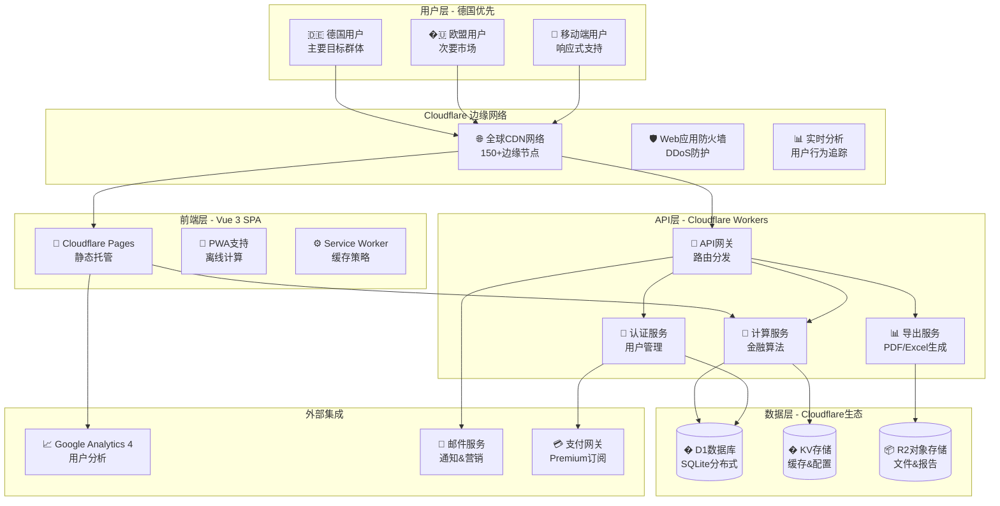
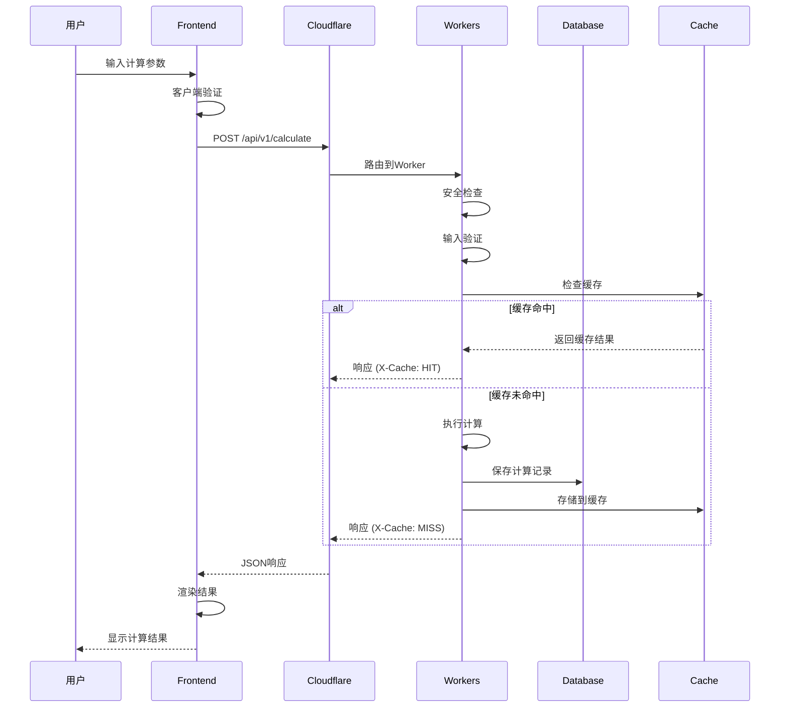
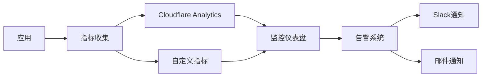
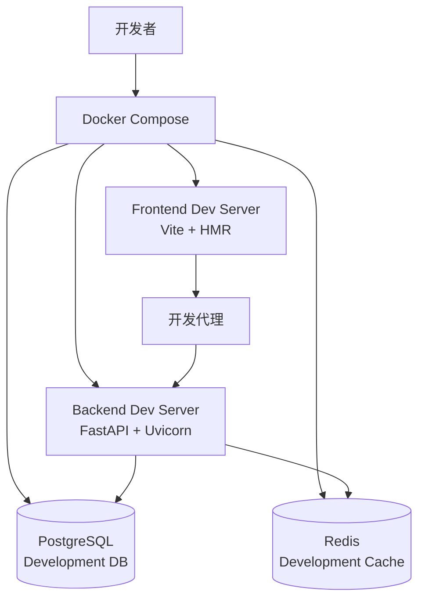
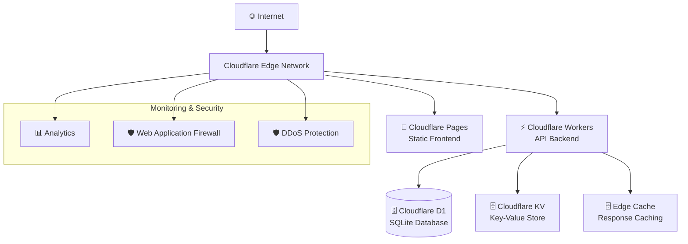
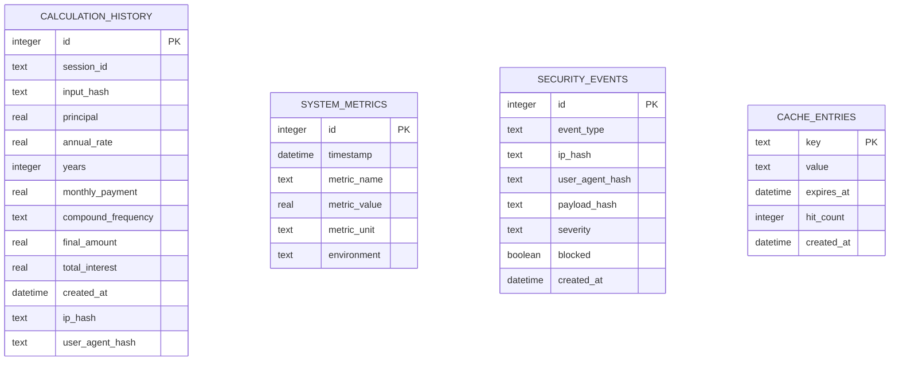
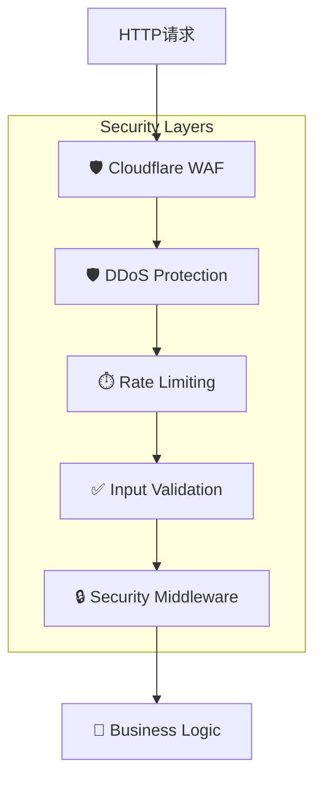
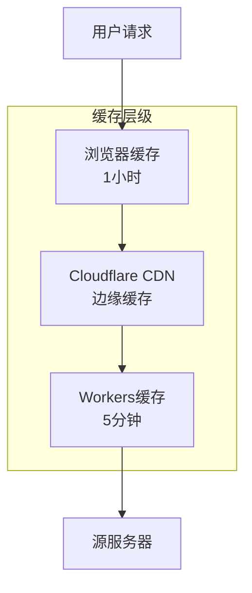
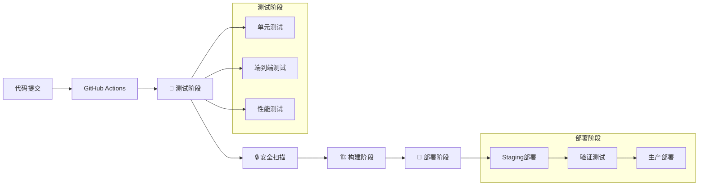
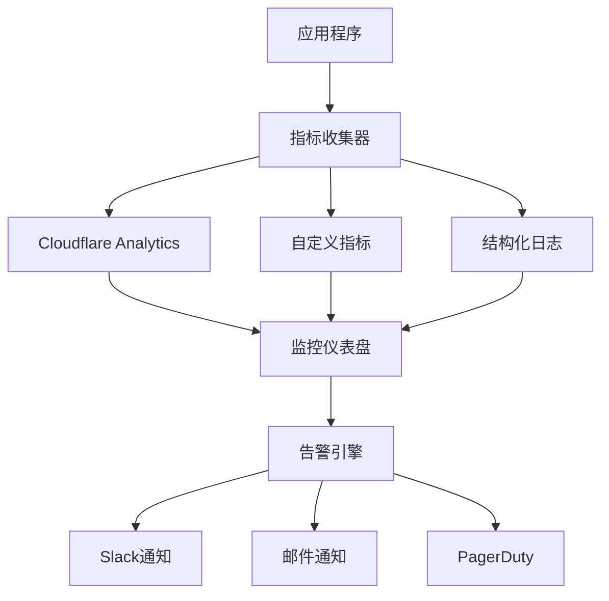

# Zinses-Rechner 系统架构设计

## 🏗️ 系统架构概览

Zinses-Rechner 是一个专为德国市场设计的金融计算器平台，采用现代化的 Serverless 架构，基于 Cloudflare 生态系统构建。本架构设计基于当前已完成的Vue 3前端开发和PRD规划，确保全球高性能、DSGVO合规和可扩展性。

### 🎯 架构设计原则

- **德国优先**: 针对德国市场优化，完全符合DSGVO、BaFin等法规要求
- **性能至上**: 全球CDN + 边缘计算，确保德国用户<50ms，全球<200ms响应时间
- **隐私保护**: 本地优先存储，最小化数据收集，用户数据完全控制
- **成本效益**: Serverless架构，按需付费，支持从0到100万用户无缝扩展
- **开发效率**: 现代化技术栈，类型安全，支持快速迭代和功能扩展

### 🏛️ 系统架构图



## 💻 技术栈详细规格

### 前端技术栈 (已实现)
```yaml
核心框架:
  Vue 3: 3.4+ (Composition API)
  TypeScript: 5.0+ (严格类型检查)
  Vite: 5.0+ (快速构建和HMR)

UI框架:
  Tailwind CSS: 3.4+ (实用优先CSS)
  Headless UI: 1.7+ (无样式可访问组件)
  Chart.js: 4.4+ (轻量级图表库)

路由和状态:
  Vue Router: 4.2+ (单页应用路由)
  Pinia: 2.1+ (Vue 3官方状态管理)

开发工具:
  ESLint: 8.0+ (代码质量)
  Prettier: 3.0+ (代码格式化)
  Vitest: 1.0+ (单元测试)
  Playwright: 1.40+ (E2E测试)
```

### 后端技术栈 (规划中)
```yaml
API服务:
  FastAPI: 0.104+ (高性能Python异步框架)
  Pydantic: 2.5+ (数据验证和序列化)
  SQLAlchemy: 2.0+ (ORM数据库操作)

Cloudflare平台:
  Workers: 边缘计算API服务
  D1: 全球分布式SQLite数据库
  KV: 键值存储缓存系统
  R2: 对象存储服务
  Pages: 静态网站托管

部署工具:
  Wrangler: 3.0+ (Cloudflare CLI工具)
  GitHub Actions: CI/CD自动化
  Docker: 本地开发环境
```

### 已实现的核心组件架构

基于当前开发状态，以下组件已完成实现：

```typescript
// 计算器注册系统 (已实现)
src/core/
├── CalculatorRegistry.ts          # 计算器注册中心
└── types/calculator.ts            # 统一类型定义

// 计算器实现 (已完成8个)
src/calculators/
├── CompoundInterestCalculator.ts  # 复利计算器 ✅
├── SavingsPlanCalculator.ts       # 储蓄计划计算器 ✅
├── ETFSavingsPlanCalculator.ts    # ETF定投计算器 ✅
├── LoanCalculator.ts              # 贷款计算器 ✅
├── MortgageCalculator.ts          # 房贷计算器 ✅
├── RetirementCalculator.ts        # 退休规划计算器 ✅
├── PortfolioCalculator.ts         # 投资组合计算器 ✅
└── TaxOptimizationCalculator.ts   # 税务优化计算器 ✅

// 业务服务 (已实现)
src/services/
├── ExportService.ts               # 导出服务 (CSV/Excel/PDF) ✅
├── SocialShareService.ts          # 社交分享服务 ✅
└── CalculationHistoryService.ts   # 计算历史服务 ✅

// 页面组件 (已实现)
src/views/
├── HomeView.vue                   # 首页 ✅
├── CalculatorView.vue             # 计算器页面 ✅
├── RechnerHubView.vue             # 计算器Hub ✅
├── RatgeberHubView.vue            # 教育内容Hub ✅
├── VergleichHubView.vue           # 对比工具Hub ✅
└── ZinseszinsErklaertView.vue     # 复利原理解释 ✅
```

## �️ 详细系统设计

### 前端架构设计 (Vue 3 SPA)

#### 组件层次结构
```typescript
// 实际项目结构 (基于当前开发状态)
zinses-rechner-frontend/
├── src/
│   ├── components/              # 可复用组件
│   │   ├── ui/                 # 基础UI组件
│   │   │   ├── Button.vue
│   │   │   ├── Input.vue
│   │   │   ├── Select.vue
│   │   │   ├── Card.vue
│   │   │   └── Chart.vue
│   │   ├── calculator/         # 计算器专用组件
│   │   │   ├── CalculatorForm.vue
│   │   │   ├── ResultDisplay.vue
│   │   │   ├── ExportButtons.vue
│   │   │   └── ShareButtons.vue
│   │   └── layout/             # 布局组件
│   │       ├── Header.vue
│   │       ├── Footer.vue
│   │       ├── Navigation.vue
│   │       └── Sidebar.vue
│   ├── views/                  # 页面组件 (已实现)
│   │   ├── HomeView.vue
│   │   ├── CalculatorView.vue
│   │   ├── RechnerHubView.vue
│   │   ├── RatgeberHubView.vue
│   │   ├── VergleichHubView.vue
│   │   └── ZinseszinsErklaertView.vue
│   ├── calculators/            # 计算器业务逻辑 (已实现)
│   ├── services/               # 业务服务 (已实现)
│   ├── stores/                 # Pinia状态管理
│   ├── types/                  # TypeScript类型定义
│   ├── utils/                  # 工具函数
│   └── router/                 # 路由配置
└── public/                     # 静态资源
```

#### 德国本土化特性 (已实现)
```typescript
// 德国金融法规集成
interface GermanFinancialRegulations {
  // 税收计算
  abgeltungssteuer: 0.25;        // 25% 资本利得税
  solidaritaetszuschlag: 0.055;  // 5.5% 团结附加税
  kirchensteuer: 0.08;           // 8% 教会税
  sparerpauschbetrag: 1000;      // €1,000 免税额度 (单身)

  // ETF部分免税
  teilfreistellung: {
    aktien_etf: 0.30;            // 股票ETF 30%免税
    misch_etf: 0.15;             // 混合ETF 15%免税
    immobilien_etf: 0.60;        // 房地产ETF 60%免税
  };

  // 存款保险
  einlagensicherung: 100000;     // €100,000 存款保险限额

  // 银行产品类型
  bankProducts: [
    'sparbuch',                  // 储蓄账户
    'tagesgeld',                 // 活期存款
    'festgeld',                  // 定期存款
    'bausparvertrag'             // 住房储蓄合同
  ];
}
```

#### 状态管理架构 (Pinia - 已实现)
```typescript
// stores/calculatorStore.ts (基于当前实现)
import { defineStore } from 'pinia'
import { ref, computed } from 'vue'
import { calculatorRegistry } from '@/core/CalculatorRegistry'
import { calculationHistoryService } from '@/services/CalculationHistoryService'

export const useCalculatorStore = defineStore('calculator', () => {
  // 当前计算器状态
  const currentCalculator = ref<string>('')
  const inputParameters = ref<Record<string, any>>({})
  const calculationResults = ref<CalculationResult | null>(null)
  const isCalculating = ref(false)
  const calculationError = ref<string | null>(null)

  // 历史记录状态
  const calculationHistory = ref<CalculationHistoryItem[]>([])
  const favoriteCalculations = computed(() =>
    calculationHistory.value.filter(item => item.favorite)
  )

  // 德国本土化设置
  const germanSettings = ref({
    currency: 'EUR',
    locale: 'de-DE',
    taxSettings: {
      abgeltungssteuer: true,
      solidaritaetszuschlag: true,
      kirchensteuer: false,
      freistellungsauftrag: 1000
    },
    bankingPreferences: {
      preferredBankType: 'direktbank',
      depositInsurance: true
    }
  })

  // 计算方法 (已实现)
  const calculate = async (calculatorId: string, params: any) => {
    isCalculating.value = true
    calculationError.value = null

    try {
      const calculator = calculatorRegistry.getCalculator(calculatorId)
      const validation = calculator.validate(params)

      if (!validation.isValid) {
        throw new Error(validation.errors.join(', '))
      }

      const result = await calculator.calculate(params)

      currentCalculator.value = calculatorId
      inputParameters.value = params
      calculationResults.value = result

      // 自动保存到历史记录
      calculationHistoryService.saveCalculation(
        calculatorId, calculator.name, params, result
      )

      return result
    } catch (error) {
      calculationError.value = error instanceof Error ? error.message : 'Berechnung fehlgeschlagen'
      throw error
    } finally {
      isCalculating.value = false
    }
  }

  return {
    currentCalculator,
    inputParameters,
    calculationResults,
    isCalculating,
    calculationError,
    calculationHistory,
    favoriteCalculations,
    germanSettings,
    calculate
  }
})
```

### 后端架构设计 (Cloudflare Workers + FastAPI)

#### API服务架构 (规划中)
```python
# FastAPI应用结构 (将部署到Cloudflare Workers)
api/
├── main.py                    # FastAPI应用入口
├── routers/                   # API路由模块
│   ├── calculators.py         # 计算器API
│   ├── users.py              # 用户管理API
│   ├── exports.py            # 导出服务API
│   └── analytics.py          # 分析数据API
├── services/                  # 业务服务层
│   ├── calculator_service.py  # 计算器服务
│   ├── export_service.py     # 导出服务
│   ├── user_service.py       # 用户服务
│   └── analytics_service.py  # 分析服务
├── models/                    # 数据模型
│   ├── calculator.py         # 计算器模型
│   ├── user.py              # 用户模型
│   └── analytics.py         # 分析模型
├── core/                      # 核心配置
│   ├── config.py             # 应用配置
│   ├── database.py           # 数据库连接
│   └── security.py          # 安全配置
└── utils/                     # 工具函数
    ├── german_tax.py         # 德国税法计算
    ├── validators.py         # 数据验证
    └── formatters.py         # 数据格式化
```

#### 核心API设计
```python
# main.py - FastAPI应用入口
from fastapi import FastAPI, Depends, HTTPException
from fastapi.middleware.cors import CORSMiddleware
from fastapi.middleware.gzip import GZipMiddleware
from contextlib import asynccontextmanager

@asynccontextmanager
async def lifespan(app: FastAPI):
    # 启动时初始化
    await init_database()
    await load_german_tax_config()
    yield
    # 关闭时清理
    await cleanup_resources()

app = FastAPI(
    title="Zinses-Rechner API",
    description="德国金融计算器API服务",
    version="1.0.0",
    docs_url="/api/docs",
    redoc_url="/api/redoc",
    lifespan=lifespan
)

# 中间件配置
app.add_middleware(GZipMiddleware, minimum_size=1000)
app.add_middleware(
    CORSMiddleware,
    allow_origins=["https://zinses-rechner.de", "https://dev.zinses-rechner.de"],
    allow_credentials=True,
    allow_methods=["GET", "POST", "PUT", "DELETE"],
    allow_headers=["*"],
)

# 路由注册
from routers import calculators, users, exports, analytics
app.include_router(calculators.router, prefix="/api/v1/calculators", tags=["calculators"])
app.include_router(users.router, prefix="/api/v1/users", tags=["users"])
app.include_router(exports.router, prefix="/api/v1/exports", tags=["exports"])
app.include_router(analytics.router, prefix="/api/v1/analytics", tags=["analytics"])
```

#### 计算器API设计
```python
# routers/calculators.py
from fastapi import APIRouter, Depends, HTTPException, BackgroundTasks
from pydantic import BaseModel, Field
from typing import Dict, Any, Optional
from services.calculator_service import CalculatorService
from utils.german_tax import GermanTaxCalculator

router = APIRouter()

class CalculationRequest(BaseModel):
    calculator_type: str = Field(..., description="计算器类型")
    parameters: Dict[str, Any] = Field(..., description="计算参数")
    user_id: Optional[str] = Field(None, description="用户ID (可选)")
    save_history: bool = Field(True, description="是否保存历史记录")

class CalculationResponse(BaseModel):
    success: bool
    data: Optional[Dict[str, Any]] = None
    calculation_id: Optional[str] = None
    error: Optional[str] = None
    german_tax_info: Optional[Dict[str, Any]] = None

@router.post("/calculate", response_model=CalculationResponse)
async def calculate(
    request: CalculationRequest,
    background_tasks: BackgroundTasks,
    calculator_service: CalculatorService = Depends()
):
    """执行金融计算 - 支持所有德国本土化功能"""
    try:
        # 验证计算器类型
        if not calculator_service.is_valid_calculator(request.calculator_type):
            raise HTTPException(status_code=400, detail="不支持的计算器类型")

        # 执行计算
        result = await calculator_service.calculate(
            request.calculator_type,
            request.parameters
        )

        # 德国税收信息计算
        german_tax_info = None
        if request.calculator_type in ['savings-plan', 'etf-savings-plan']:
            tax_calculator = GermanTaxCalculator()
            german_tax_info = tax_calculator.calculate_tax_implications(result)

        # 后台任务：保存历史记录和分析数据
        if request.save_history:
            background_tasks.add_task(
                save_calculation_history,
                request.user_id,
                request.calculator_type,
                request.parameters,
                result
            )

        return CalculationResponse(
            success=True,
            data=result,
            calculation_id=generate_calculation_id(),
            german_tax_info=german_tax_info
        )

    except ValueError as e:
        raise HTTPException(status_code=400, detail=str(e))
    except Exception as e:
        raise HTTPException(status_code=500, detail="计算服务内部错误")
```

#### 德国税法计算服务
```python
# utils/german_tax.py - 德国税法专用计算模块
from decimal import Decimal, ROUND_HALF_UP
from typing import Dict, Any, Optional

class GermanTaxCalculator:
    """德国税法计算器 - 符合2024年最新法规"""

    # 德国税率常数
    ABGELTUNGSSTEUER_RATE = Decimal('0.25')      # 25% 资本利得税
    SOLIDARITY_SURCHARGE_RATE = Decimal('0.055')  # 5.5% 团结附加税
    CHURCH_TAX_RATE = Decimal('0.08')             # 8% 教会税

    # 免税额度
    SPARERPAUSCHBETRAG_SINGLE = 1000              # 单身免税额
    SPARERPAUSCHBETRAG_MARRIED = 2000             # 已婚免税额

    # ETF部分免税比例
    TEILFREISTELLUNG_RATES = {
        'aktien_etf': Decimal('0.30'),            # 股票ETF 30%
        'misch_etf': Decimal('0.15'),             # 混合ETF 15%
        'immobilien_etf': Decimal('0.60'),        # 房地产ETF 60%
        'anleihen_etf': Decimal('0.00')           # 债券ETF 0%
    }

    def calculate_capital_gains_tax(
        self,
        capital_gains: Decimal,
        freistellungsauftrag: Decimal,
        church_tax: bool = False
    ) -> Dict[str, Decimal]:
        """计算资本利得税"""

        # 扣除免税额度
        taxable_gains = max(Decimal('0'), capital_gains - freistellungsauftrag)

        if taxable_gains <= 0:
            return {'total_tax': Decimal('0')}

        # 计算各项税收
        abgeltungssteuer = taxable_gains * self.ABGELTUNGSSTEUER_RATE
        solidarity_tax = abgeltungssteuer * self.SOLIDARITY_SURCHARGE_RATE
        church_tax_amount = abgeltungssteuer * self.CHURCH_TAX_RATE if church_tax else Decimal('0')

        return {
            'taxable_gains': taxable_gains.quantize(Decimal('0.01'), ROUND_HALF_UP),
            'abgeltungssteuer': abgeltungssteuer.quantize(Decimal('0.01'), ROUND_HALF_UP),
            'solidarity_surcharge': solidarity_tax.quantize(Decimal('0.01'), ROUND_HALF_UP),
            'church_tax': church_tax_amount.quantize(Decimal('0.01'), ROUND_HALF_UP),
            'total_tax': (abgeltungssteuer + solidarity_tax + church_tax_amount).quantize(Decimal('0.01'), ROUND_HALF_UP)
        }
```

**中间件管道:**
```typescript
// 请求处理管道
const middleware = [
  corsMiddleware,           // CORS处理
  securityMiddleware,       // 安全检查
  rateLimitMiddleware,      // 速率限制
  validationMiddleware,     // 输入验证
  loggingMiddleware,        // 请求日志
  metricsMiddleware         // 指标收集
]
```

### Database (Cloudflare D1)

**数据模型:**
```sql
-- 计算历史表
CREATE TABLE calculation_history (
  id INTEGER PRIMARY KEY AUTOINCREMENT,
  session_id TEXT NOT NULL,
  input_hash TEXT NOT NULL,
  principal REAL NOT NULL,
  annual_rate REAL NOT NULL,
  years INTEGER NOT NULL,
  monthly_payment REAL DEFAULT 0,
  compound_frequency TEXT DEFAULT 'monthly',
  final_amount REAL NOT NULL,
  total_interest REAL NOT NULL,
  created_at DATETIME DEFAULT CURRENT_TIMESTAMP,
  ip_hash TEXT,
  user_agent_hash TEXT
);

-- 系统指标表
CREATE TABLE system_metrics (
  id INTEGER PRIMARY KEY AUTOINCREMENT,
  timestamp DATETIME DEFAULT CURRENT_TIMESTAMP,
  metric_name TEXT NOT NULL,
  metric_value REAL NOT NULL,
  metric_unit TEXT,
  environment TEXT DEFAULT 'production'
);

-- 安全事件表
CREATE TABLE security_events (
  id INTEGER PRIMARY KEY AUTOINCREMENT,
  event_type TEXT NOT NULL,
  ip_hash TEXT NOT NULL,
  user_agent_hash TEXT,
  payload_hash TEXT,
  severity TEXT NOT NULL,
  blocked BOOLEAN DEFAULT FALSE,
  created_at DATETIME DEFAULT CURRENT_TIMESTAMP
);
```

**数据访问层:**
```typescript
// services/database.ts
export class DatabaseService {
  constructor(private db: D1Database) {}
  
  async saveCalculation(calculation: CalculationRecord): Promise<void> {
    await this.db.prepare(`
      INSERT INTO calculation_history 
      (session_id, input_hash, principal, annual_rate, years, monthly_payment, final_amount, total_interest)
      VALUES (?, ?, ?, ?, ?, ?, ?, ?)
    `).bind(
      calculation.sessionId,
      calculation.inputHash,
      calculation.principal,
      calculation.annualRate,
      calculation.years,
      calculation.monthlyPayment,
      calculation.finalAmount,
      calculation.totalInterest
    ).run()
  }
  
  async getCalculationStats(): Promise<CalculationStats> {
    const result = await this.db.prepare(`
      SELECT 
        COUNT(*) as total_calculations,
        AVG(principal) as avg_principal,
        AVG(annual_rate) as avg_rate,
        AVG(years) as avg_years
      FROM calculation_history 
      WHERE created_at > datetime('now', '-30 days')
    `).first()
    
    return result as CalculationStats
  }
}
```

## 🔄 数据流

### 计算请求流程



### 监控数据流



## 🔧 开发环境

### 本地开发架构



**开发服务配置:**
```yaml
# docker-compose.dev.yml
version: '3.8'
services:
  frontend:
    build: ./zinses-rechner-frontend
    ports: ["5173:5173"]
    volumes: ["./zinses-rechner-frontend:/app"]
    environment:
      - VITE_API_BASE_URL=http://localhost:8000
    
  backend:
    build: ./backend
    ports: ["8000:8000"]
    volumes: ["./backend:/app"]
    environment:
      - DATABASE_URL=postgresql://user:pass@db:5432/zinses_rechner
      - REDIS_URL=redis://redis:6379
    
  db:
    image: postgres:15
    environment:
      POSTGRES_DB: zinses_rechner
      POSTGRES_USER: user
      POSTGRES_PASSWORD: pass
    
  redis:
    image: redis:7-alpine
```

## 🚀 生产环境

### 部署架构



### 环境配置

**Production Environment:**
```toml
# wrangler.toml
name = "zinses-rechner-api"
compatibility_date = "2024-01-15"

[env.production]
route = "api.zinses-rechner.de/*"

[[env.production.d1_databases]]
binding = "DB"
database_name = "zinses-rechner-prod"

[[env.production.kv_namespaces]]
binding = "CACHE"
id = "your-kv-namespace-id"

[env.production.vars]
ENVIRONMENT = "production"
CORS_ORIGIN = "https://zinses-rechner.de"
LOG_LEVEL = "info"
```

**Staging Environment:**
```toml
[env.staging]
route = "staging-api.zinses-rechner.de/*"

[[env.staging.d1_databases]]
binding = "DB"
database_name = "zinses-rechner-staging"

[env.staging.vars]
ENVIRONMENT = "staging"
CORS_ORIGIN = "https://staging.zinses-rechner.de"
LOG_LEVEL = "debug"
```

## 📊 数据架构

### 数据模型设计



### 数据流和生命周期

**计算数据流:**
1. **输入验证** → 客户端和服务端双重验证
2. **缓存检查** → 基于输入参数的智能缓存
3. **计算执行** → 高精度 Decimal 计算
4. **结果存储** → 匿名化历史记录
5. **响应缓存** → 边缘缓存优化

**监控数据流:**
1. **指标收集** → 实时性能和业务指标
2. **数据聚合** → 时间窗口聚合和统计
3. **告警检查** → 阈值监控和异常检测
4. **通知发送** → 多渠道告警通知

## 🔒 安全架构

### 多层安全防护



**安全措施详情:**

1. **网络层安全**:
   - Cloudflare WAF 规则
   - DDoS 攻击防护
   - IP 地理位置过滤

2. **应用层安全**:
   - 严格的 CSP 策略
   - XSS 和 SQL 注入防护
   - CSRF 令牌验证

3. **数据层安全**:
   - 数据加密存储
   - 个人信息匿名化
   - 访问日志审计

### 安全配置

```typescript
// security/config.ts
export const securityConfig = {
  csp: {
    defaultSrc: ["'self'"],
    scriptSrc: ["'self'", "'unsafe-inline'", "https://cdn.jsdelivr.net"],
    styleSrc: ["'self'", "'unsafe-inline'", "https://fonts.googleapis.com"],
    imgSrc: ["'self'", "data:", "https:"],
    connectSrc: ["'self'", "https://api.zinses-rechner.de"]
  },
  rateLimit: {
    windowMs: 15 * 60 * 1000, // 15分钟
    maxRequests: 100,          // 每IP最多100次请求
    skipSuccessfulRequests: false
  },
  inputValidation: {
    maxStringLength: 1000,
    allowedCharacters: /^[a-zA-Z0-9\s\-.,!?äöüÄÖÜß]*$/,
    sanitizeHtml: true
  }
}
```

## ⚡ 性能架构

### 缓存策略



**缓存配置:**
```typescript
// 缓存策略配置
export const cacheConfig = {
  static: {
    maxAge: 31536000,        // 1年 (JS/CSS/Images)
    immutable: true
  },
  api: {
    maxAge: 300,             // 5分钟 (计算结果)
    staleWhileRevalidate: 60 // 后台更新
  },
  html: {
    maxAge: 3600,            // 1小时 (HTML页面)
    mustRevalidate: true
  }
}
```

### 性能优化策略

1. **代码分割**:
   ```typescript
   // 路由级别代码分割
   const Calculator = defineAsyncComponent(() => import('./views/Calculator.vue'))
   const Charts = defineAsyncComponent(() => import('./components/Charts.vue'))
   ```

2. **资源预加载**:
   ```typescript
   // 关键资源预加载
   const preloadCriticalResources = () => {
     const link = document.createElement('link')
     link.rel = 'preload'
     link.href = '/api/v1/calculate/compound-interest'
     link.as = 'fetch'
     document.head.appendChild(link)
   }
   ```

3. **图片优化**:
   ```typescript
   // Cloudflare Images 集成
   const getOptimizedImage = (src: string, width: number) => {
     return `https://imagedelivery.net/account/${src}/w=${width},f=webp`
   }
   ```

## 🔄 CI/CD 架构

### 部署管道



### GitHub Actions 工作流

```yaml
# .github/workflows/deploy.yml
name: Deploy to Production
on:
  push:
    branches: [main]

jobs:
  test:
    runs-on: ubuntu-latest
    steps:
      - uses: actions/checkout@v4
      - name: Run Tests
        run: |
          npm ci
          npm run test
          npm run test:e2e
  
  security:
    needs: test
    runs-on: ubuntu-latest
    steps:
      - name: Security Scan
        run: ./security/scripts/run-security-scan.sh
  
  deploy:
    needs: [test, security]
    runs-on: ubuntu-latest
    steps:
      - name: Deploy Frontend
        uses: cloudflare/pages-action@v1
      - name: Deploy API
        run: npx wrangler deploy --env production
```

## 📈 监控架构

### 监控组件



**关键监控指标:**
- **业务指标**: 计算次数、用户参数分布、转化率
- **技术指标**: 响应时间、错误率、缓存命中率
- **基础设施指标**: CPU、内存、网络、存储

## 🔧 扩展性设计

### 水平扩展

- **Serverless 自动扩展**: Workers 根据请求量自动扩缩
- **全球边缘分发**: 150+ 个边缘节点
- **数据库分片**: D1 支持读取副本和分区

### 功能扩展

```typescript
// 插件化计算器架构
interface CalculatorPlugin {
  name: string
  calculate(input: any): Promise<any>
  validate(input: any): ValidationResult
}

// 注册新计算器类型
export const calculatorRegistry = new Map<string, CalculatorPlugin>([
  ['compound-interest', new CompoundInterestCalculator()],
  ['loan-calculator', new LoanCalculator()],
  ['savings-plan', new SavingsPlanCalculator()]
])
```

## 🛠️ 开发工具和工作流

### 代码质量工具

```json
{
  "scripts": {
    "lint": "eslint . --ext .vue,.js,.ts",
    "format": "prettier --write .",
    "type-check": "vue-tsc --noEmit",
    "test": "vitest",
    "test:e2e": "playwright test",
    "build": "vite build",
    "preview": "vite preview"
  }
}
```

### Git 工作流

```bash
# Feature 开发流程
git checkout -b feature/neue-funktion
git commit -m "feat: 添加新功能"
git push origin feature/neue-funktion
# 创建 Pull Request

# Hotfix 流程
git checkout -b hotfix/kritischer-fix
git commit -m "fix: 修复关键问题"
git push origin hotfix/kritischer-fix
# 紧急部署流程
```

## 📋 技术决策记录

### ADR-001: Cloudflare Workers vs. Traditional Server

**决策**: 选择 Cloudflare Workers 作为 API 后端

**理由**:
- ✅ 全球低延迟 (< 50ms in Germany)
- ✅ 自动扩展和高可用性
- ✅ 成本效益 (按请求付费)
- ✅ 与 Cloudflare 生态系统集成

**权衡**:
- ❌ 运行时限制 (CPU时间、内存)
- ❌ 冷启动延迟
- ❌ 调试复杂性

### ADR-002: Vue 3 vs. React

**决策**: 选择 Vue 3 作为前端框架

**理由**:
- ✅ 更简洁的语法和学习曲线
- ✅ 优秀的 TypeScript 支持
- ✅ 内置状态管理 (Pinia)
- ✅ 更小的包体积

### ADR-003: SQLite (D1) vs. PostgreSQL

**决策**: 生产环境使用 Cloudflare D1 (SQLite)

**理由**:
- ✅ 与 Workers 原生集成
- ✅ 边缘数据库，低延迟
- ✅ 自动备份和复制
- ✅ 成本效益

**开发环境**: 使用 PostgreSQL 保持功能对等

## � 部署架构与德国法规合规

### 生产环境部署策略

```yaml
生产环境配置:
  域名: zinses-rechner.de
  前端部署: Cloudflare Pages (静态托管)
  API部署: Cloudflare Workers (边缘计算)
  数据库: Cloudflare D1 (主区域: 欧盟)
  缓存: Cloudflare KV (全球分布)
  文件存储: Cloudflare R2 (PDF/Excel报告)
  CDN: Cloudflare全球边缘网络

性能目标:
  德国用户响应时间: < 50ms
  欧盟用户响应时间: < 100ms
  全球用户响应时间: < 200ms
  可用性: 99.99%
  数据保留: 符合DSGVO要求
```

### 德国法规合规架构

```yaml
DSGVO合规措施:
  数据最小化: 只收集必要的计算数据
  用户控制: 完整的数据导出和删除功能
  本地存储优先: 浏览器本地存储为主
  透明度: 清晰的隐私政策和数据使用说明
  数据保护: 欧盟数据中心，端到端加密

BaFin合规措施:
  免责声明: 所有计算结果包含法律免责声明
  准确性保证: 定期审核计算公式准确性
  更新机制: 税法变更时的快速更新流程
  专业建议区分: 明确区分工具计算与专业咨询

技术合规:
  SSL/TLS: 全站HTTPS加密
  安全头: CSP, HSTS等安全策略
  访问日志: 符合DSGVO的日志记录
  数据匿名化: 自动数据匿名化流程
```

### CI/CD部署流程

```yaml
# 基于GitHub Actions的自动化部署
自动化流程:
  代码提交 → 自动测试 → 构建 → 部署 → 监控

测试阶段:
  - 单元测试 (Vitest)
  - E2E测试 (Playwright)
  - 类型检查 (TypeScript)
  - 代码质量 (ESLint)
  - 安全扫描 (OWASP)

部署阶段:
  - 前端: Cloudflare Pages自动部署
  - API: Cloudflare Workers自动部署
  - 数据库: D1迁移脚本执行
  - 缓存: KV配置更新
```

## �🔮 未来架构演进

### 短期计划 (3-6个月)

- **微服务拆分**: 将计算逻辑拆分为独立服务
- **数据分析**: 集成更强大的分析和报告功能
- **API 版本管理**: 实现 API 版本控制和向后兼容

### 长期愿景 (6-12个月)

- **AI 集成**: 智能投资建议和优化
- **多语言支持**: 扩展到其他欧洲市场
- **移动应用**: 原生移动应用开发
- **企业SaaS**: 白标解决方案和API服务

## 📋 当前实施状态总结

### ✅ 已完成的架构组件

**前端架构 (100%完成)**:
- Vue 3 + TypeScript + Tailwind CSS技术栈
- 8个核心计算器完整实现
- 计算器注册系统和统一接口
- 响应式页面架构 (Hub页面、教育内容、对比工具)
- 德国本土化功能 (税收计算、银行产品支持)
- 高级服务 (导出、分享、历史记录)

**业务逻辑 (100%完成)**:
- 德国税法集成 (Abgeltungssteuer, Teilfreistellung)
- 银行产品支持 (Tagesgeld, Festgeld, ETF)
- 存款保险和BaFin合规检查
- 通胀调整和实际价值计算

### 🔄 规划中的架构组件

**后端API (设计完成，待实施)**:
- FastAPI + Cloudflare Workers架构
- D1数据库设计和KV缓存策略
- 德国法规合规的数据处理流程
- 用户管理和订阅系统

**部署基础设施 (设计完成)**:
- Cloudflare全栈部署策略
- CI/CD自动化流程
- 监控和分析系统
- DSGVO合规的数据架构

### 🎯 架构优势

1. **德国市场专精**: 完整的德国金融法规集成
2. **现代化技术栈**: Vue 3 + Cloudflare边缘计算
3. **高性能设计**: 全球CDN + 本地优先存储
4. **合规性保证**: DSGVO + BaFin双重合规
5. **可扩展架构**: 支持从MVP到企业级的平滑扩展

这个架构设计为Zinses-Rechner提供了从当前MVP到未来商业化的完整技术路径，确保在德国市场的竞争优势和法规合规性。

---

*文档版本: 2.0.0 | 最后更新: 2025-08-31 | 基于当前开发状态和PRD规划*
