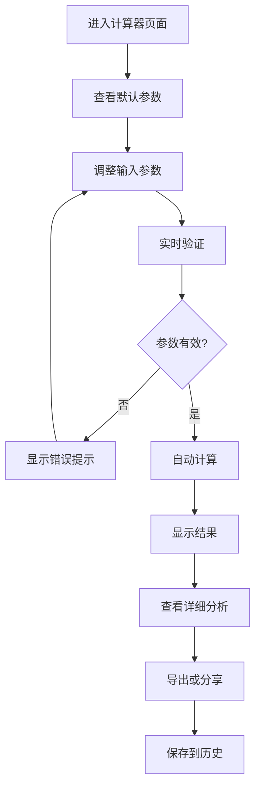

# 交互设计规范 - Zinses-Rechner

## 🎯 交互设计原则

### 1. 德国用户习惯优先
- **保守稳重**: 避免过于花哨的动画和效果
- **信息密度**: 德国用户偏好信息丰富的界面
- **精确性**: 提供详细的数字和计算过程
- **可靠性**: 每个交互都要有明确的反馈

### 2. 金融工具专业性
- **数据驱动**: 以数字和图表为核心
- **透明度**: 计算过程和假设条件清晰可见
- **准确性**: 实时验证和错误预防
- **教育性**: 帮助用户理解金融概念

## 🔄 核心交互流程

### 1. 计算器使用流程



#### 详细交互规范

**步骤1: 页面加载**
```typescript
// 页面加载时的交互
onMounted(() => {
  // 1. 显示加载状态
  showLoadingState()
  
  // 2. 加载默认参数
  loadDefaultParameters()
  
  // 3. 预填充智能默认值
  setIntelligentDefaults()
  
  // 4. 显示引导提示 (首次访问)
  if (isFirstVisit()) {
    showGuidedTour()
  }
})

// 智能默认值设置
const setIntelligentDefaults = () => {
  form.value = {
    initialAmount: 10000,      // 10,000€ 常见起始金额
    monthlyContribution: 500,   // 500€ 德国平均储蓄
    interestRate: 4.0,         // 4% 当前市场平均
    years: 15,                 // 15年 中期投资
    taxSettings: {
      freistellungsauftrag: 1000,  // 默认免税额
      churchTax: false,             // 默认无教会税
      maritalStatus: 'single'       // 默认单身
    }
  }
}
```

**步骤2: 参数输入交互**
```typescript
// 输入字段交互行为
const inputInteractions = {
  // 焦点进入时
  onFocus: (field: string) => {
    // 显示帮助文本
    showHelpText(field)
    // 高亮相关字段
    highlightRelatedFields(field)
    // 显示示例值
    showExampleValues(field)
  },
  
  // 值变化时
  onChange: (field: string, value: any) => {
    // 实时验证
    validateField(field, value)
    // 格式化显示
    formatValue(field, value)
    // 触发计算 (防抖)
    debouncedCalculate()
    // 更新相关字段
    updateRelatedFields(field, value)
  },
  
  // 焦点离开时
  onBlur: (field: string) => {
    // 最终验证
    finalValidation(field)
    // 隐藏帮助文本
    hideHelpText(field)
    // 保存到本地存储
    saveToLocalStorage()
  }
}

// 德语数字格式化
const formatGermanNumber = (value: number): string => {
  return new Intl.NumberFormat('de-DE', {
    minimumFractionDigits: 2,
    maximumFractionDigits: 2
  }).format(value)
}

// 货币格式化
const formatCurrency = (value: number): string => {
  return new Intl.NumberFormat('de-DE', {
    style: 'currency',
    currency: 'EUR'
  }).format(value)
}
```

**步骤3: 实时计算反馈**
```typescript
// 实时计算交互
const realtimeCalculation = {
  // 防抖计算
  debouncedCalculate: debounce(async () => {
    if (!isFormValid.value) return
    
    // 显示计算状态
    isCalculating.value = true
    
    try {
      // 执行计算
      const result = await calculateResults(form.value)
      
      // 动画显示结果
      await animateResultsIn(result)
      
      // 更新图表
      updateCharts(result)
      
      // 保存计算历史
      saveCalculationHistory(result)
      
    } catch (error) {
      // 显示错误状态
      showErrorState(error.message)
    } finally {
      isCalculating.value = false
    }
  }, 800),
  
  // 结果动画
  animateResultsIn: async (result: CalculationResult) => {
    // 数字滚动动画
    await animateNumbers(result.finalAmount)
    // 图表绘制动画
    await animateChart(result.yearlyBreakdown)
    // 卡片出现动画
    await animateCards()
  }
}
```

### 2. 移动端交互优化

#### 触摸交互规范
```typescript
// 移动端特定交互
const mobileInteractions = {
  // 滑动手势
  swipeGestures: {
    // 左滑查看下一个图表
    onSwipeLeft: () => {
      if (currentChartIndex.value < charts.length - 1) {
        currentChartIndex.value++
        animateChartTransition('left')
      }
    },
    
    // 右滑查看上一个图表
    onSwipeRight: () => {
      if (currentChartIndex.value > 0) {
        currentChartIndex.value--
        animateChartTransition('right')
      }
    },
    
    // 上滑显示详细信息
    onSwipeUp: () => {
      expandDetailedView()
    }
  },
  
  // 长按交互
  longPress: {
    // 长按数字复制
    onLongPressNumber: (value: number) => {
      copyToClipboard(formatCurrency(value))
      showToast('已复制到剪贴板')
    },
    
    // 长按图表显示数据点
    onLongPressChart: (dataPoint: any) => {
      showDataPointTooltip(dataPoint)
    }
  },
  
  // 双击交互
  doubleTap: {
    // 双击重置字段
    onDoubleTapField: (field: string) => {
      resetFieldToDefault(field)
      showToast(`${field} 已重置为默认值`)
    }
  }
}
```

#### 移动端布局适配
```vue
<template>
  <div class="mobile-layout">
    <!-- 可折叠的输入区域 -->
    <MobileExpandableCard
      title="Ihre Eingaben"
      :expanded="inputExpanded"
      @toggle="inputExpanded = !inputExpanded"
    >
      <MobileCalculatorForm v-model="form" />
    </MobileExpandableCard>
    
    <!-- 结果区域 -->
    <MobileExpandableCard
      title="Ihre Ergebnisse"
      :expanded="true"
      :collapsible="false"
    >
      <MobileResults :results="results" />
    </MobileExpandableCard>
    
    <!-- 底部操作栏 -->
    <div class="mobile-actions fixed bottom-0 left-0 right-0 bg-white border-t border-gray-200 p-4">
      <div class="flex space-x-3">
        <BaseButton
          variant="secondary"
          size="sm"
          @click="shareResults"
          class="flex-1"
        >
          Teilen
        </BaseButton>
        <BaseButton
          variant="secondary"
          size="sm"
          @click="exportResults"
          class="flex-1"
        >
          Export
        </BaseButton>
        <BaseButton
          variant="primary"
          size="sm"
          @click="saveToFavorites"
          class="flex-1"
        >
          Speichern
        </BaseButton>
      </div>
    </div>
  </div>
</template>
```

### 3. 德国本土化交互

#### 数字输入交互
```typescript
// 德语数字输入处理
const germanNumberInput = {
  // 处理德语小数点
  formatInput: (value: string): string => {
    // 将英文小数点转换为德语逗号
    return value.replace('.', ',')
  },
  
  // 处理千位分隔符
  addThousandsSeparator: (value: string): string => {
    const parts = value.split(',')
    parts[0] = parts[0].replace(/\B(?=(\d{3})+(?!\d))/g, '.')
    return parts.join(',')
  },
  
  // 验证德语数字格式
  validateGermanNumber: (value: string): boolean => {
    const germanNumberRegex = /^\d{1,3}(\.\d{3})*,?\d*$/
    return germanNumberRegex.test(value)
  }
}

// 货币输入特殊处理
const currencyInput = {
  // 自动添加欧元符号
  formatCurrency: (value: number): string => {
    return `${formatGermanNumber(value)} €`
  },
  
  // 智能单位转换
  handleUnitConversion: (value: string): number => {
    // 处理 "k" 表示千
    if (value.includes('k') || value.includes('K')) {
      return parseFloat(value.replace(/[kK]/g, '')) * 1000
    }
    // 处理 "m" 表示百万
    if (value.includes('m') || value.includes('M')) {
      return parseFloat(value.replace(/[mM]/g, '')) * 1000000
    }
    return parseFloat(value.replace(/[^\d,]/g, '').replace(',', '.'))
  }
}
```

#### 税收设置交互
```typescript
// 德国税收设置交互
const taxSettingsInteraction = {
  // 智能税收建议
  provideTaxAdvice: (userInput: any) => {
    const advice = []
    
    // 免税额度建议
    if (userInput.expectedGains > userInput.freistellungsauftrag) {
      advice.push({
        type: 'warning',
        title: 'Freistellungsauftrag optimieren',
        message: `Sie könnten ${userInput.freistellungsauftrag}€ steuerfrei erhalten. Nutzen Sie Ihren vollen Freibetrag!`
      })
    }
    
    // ETF类型建议
    if (userInput.calculatorType === 'etf' && userInput.etfType === 'mixed') {
      advice.push({
        type: 'info',
        title: 'Teilfreistellung beachten',
        message: 'Mischfonds haben nur 15% Teilfreistellung. Aktienfonds bieten 30%.'
      })
    }
    
    return advice
  },
  
  // 税收影响实时预览
  showTaxImpactPreview: (settings: TaxSettings) => {
    const preview = calculateTaxImpact(settings)
    
    // 显示税收影响提示
    showTooltip({
      title: 'Steuerliche Auswirkungen',
      content: `
        <div class="tax-preview">
          <div>Abgeltungssteuer: ${preview.capitalGainsTax}€</div>
          <div>Solidaritätszuschlag: ${preview.solidarityTax}€</div>
          ${settings.churchTax ? `<div>Kirchensteuer: ${preview.churchTax}€</div>` : ''}
          <div class="font-bold">Gesamt: ${preview.totalTax}€</div>
        </div>
      `
    })
  }
}
```

## 🎨 动画和过渡效果

### 1. 页面过渡动画
```css
/* 页面切换动画 */
.page-transition-enter-active,
.page-transition-leave-active {
  transition: all 0.3s ease-in-out;
}

.page-transition-enter-from {
  opacity: 0;
  transform: translateX(20px);
}

.page-transition-leave-to {
  opacity: 0;
  transform: translateX(-20px);
}

/* 结果卡片出现动画 */
.result-card-enter-active {
  transition: all 0.5s ease-out;
}

.result-card-enter-from {
  opacity: 0;
  transform: translateY(30px) scale(0.95);
}

/* 数字滚动动画 */
@keyframes numberRoll {
  from {
    transform: translateY(20px);
    opacity: 0;
  }
  to {
    transform: translateY(0);
    opacity: 1;
  }
}

.number-roll {
  animation: numberRoll 0.8s ease-out;
}
```

### 2. 交互反馈动画
```typescript
// 按钮点击反馈
const buttonFeedback = {
  onClick: (element: HTMLElement) => {
    // 添加点击波纹效果
    element.classList.add('button-ripple')
    
    // 触觉反馈 (移动端)
    if ('vibrate' in navigator) {
      navigator.vibrate(50)
    }
    
    // 移除动画类
    setTimeout(() => {
      element.classList.remove('button-ripple')
    }, 300)
  }
}

// 表单验证反馈
const validationFeedback = {
  showError: (field: HTMLElement, message: string) => {
    // 添加错误样式
    field.classList.add('field-error')
    
    // 轻微震动动画
    field.style.animation = 'shake 0.5s ease-in-out'
    
    // 显示错误消息
    showErrorMessage(message)
    
    // 清理动画
    setTimeout(() => {
      field.style.animation = ''
    }, 500)
  },
  
  showSuccess: (field: HTMLElement) => {
    // 添加成功样式
    field.classList.add('field-success')
    
    // 成功图标动画
    const icon = field.querySelector('.success-icon')
    if (icon) {
      icon.style.animation = 'checkmark 0.6s ease-in-out'
    }
  }
}
```

### 3. 图表动画
```typescript
// 图表绘制动画
const chartAnimations = {
  // 线条绘制动画
  animateLineChart: (chart: Chart) => {
    chart.data.datasets.forEach((dataset, index) => {
      dataset.pointRadius = 0
      
      // 逐步显示数据点
      const totalPoints = dataset.data.length
      let currentPoint = 0
      
      const interval = setInterval(() => {
        if (currentPoint < totalPoints) {
          dataset.pointRadius[currentPoint] = 4
          chart.update('none')
          currentPoint++
        } else {
          clearInterval(interval)
        }
      }, 100)
    })
  },
  
  // 柱状图增长动画
  animateBarChart: (chart: Chart) => {
    const originalData = [...chart.data.datasets[0].data]
    chart.data.datasets[0].data = new Array(originalData.length).fill(0)
    chart.update()
    
    // 逐步增长到目标值
    const duration = 1000
    const steps = 60
    const stepDuration = duration / steps
    
    let currentStep = 0
    const interval = setInterval(() => {
      if (currentStep <= steps) {
        const progress = currentStep / steps
        chart.data.datasets[0].data = originalData.map(value => 
          value * easeOutCubic(progress)
        )
        chart.update('none')
        currentStep++
      } else {
        clearInterval(interval)
      }
    }, stepDuration)
  }
}

// 缓动函数
const easeOutCubic = (t: number): number => {
  return 1 - Math.pow(1 - t, 3)
}
```

## 📱 响应式交互适配

### 断点定义
```typescript
const breakpoints = {
  sm: 640,   // 小屏手机
  md: 768,   // 平板
  lg: 1024,  // 小桌面
  xl: 1280,  // 大桌面
  '2xl': 1536 // 超大屏
}

// 响应式交互适配
const responsiveInteractions = {
  // 根据屏幕尺寸调整交互
  adaptToScreenSize: () => {
    const width = window.innerWidth
    
    if (width < breakpoints.md) {
      // 移动端交互
      enableMobileInteractions()
      disableHoverEffects()
      increaseTouchTargets()
    } else {
      // 桌面端交互
      enableDesktopInteractions()
      enableHoverEffects()
      enableKeyboardShortcuts()
    }
  },
  
  // 移动端特定交互
  enableMobileInteractions: () => {
    // 启用滑动手势
    enableSwipeGestures()
    // 启用长按菜单
    enableLongPressMenus()
    // 调整滚动行为
    adjustScrollBehavior()
  },
  
  // 桌面端特定交互
  enableDesktopInteractions: () => {
    // 启用键盘快捷键
    enableKeyboardShortcuts()
    // 启用悬停效果
    enableHoverTooltips()
    // 启用右键菜单
    enableContextMenus()
  }
}
```

这个交互设计规范涵盖了德国用户的使用习惯、移动端优化和专业的金融工具交互模式。接下来我将创建UI提示词文档。
