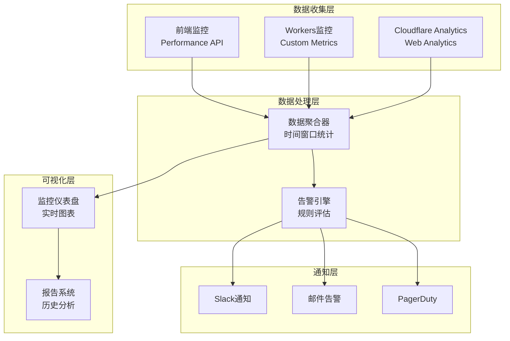
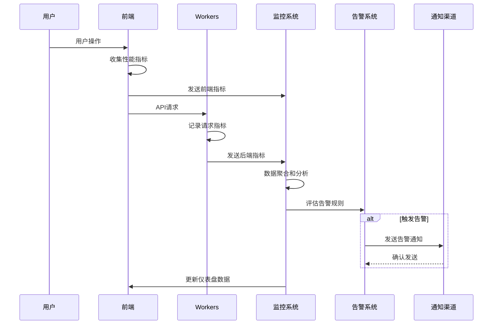

# Zinses-Rechner 监控指南

## 📊 监控概览

Zinses-Rechner 实施了全面的监控和可观测性策略，确保系统健康、性能优化和问题快速响应。

## 🎯 监控目标

### 关键性能指标 (KPIs)

**用户体验指标:**
- **页面加载时间**: < 2秒 (LCP)
- **交互响应时间**: < 100ms (FID)
- **视觉稳定性**: < 0.1 (CLS)
- **API 响应时间**: < 500ms (P95)

**业务指标:**
- **计算成功率**: > 99.9%
- **用户转化率**: 跟踪从访问到计算的转化
- **功能使用率**: 各计算功能的使用分布
- **用户留存率**: 重复访问用户比例

**技术指标:**
- **系统可用性**: > 99.9%
- **错误率**: < 0.1%
- **缓存命中率**: > 85%
- **资源使用率**: CPU < 80%, Memory < 80%

## 🏗️ 监控架构

### 监控组件图



### 数据流架构



## 📈 监控仪表盘

### 1. 主仪表盘组件

**实时指标卡片:**
```typescript
// components/monitoring/MetricsCard.vue
interface MetricCard {
  title: string
  value: number | string
  unit: string
  trend: 'up' | 'down' | 'stable'
  status: 'healthy' | 'warning' | 'critical'
  target?: number
  description: string
}

const metricsCards: MetricCard[] = [
  {
    title: 'API响应时间',
    value: 245,
    unit: 'ms',
    trend: 'stable',
    status: 'healthy',
    target: 500,
    description: 'P95响应时间'
  },
  {
    title: '并发RPS',
    value: 127,
    unit: 'req/s',
    trend: 'up',
    status: 'healthy',
    target: 1000,
    description: '当前每秒请求数'
  },
  {
    title: '内存使用率',
    value: 65,
    unit: '%',
    trend: 'stable',
    status: 'healthy',
    target: 80,
    description: 'Workers内存使用'
  },
  {
    title: '缓存命中率',
    value: 89,
    unit: '%',
    trend: 'up',
    status: 'healthy',
    target: 85,
    description: 'Edge缓存命中率'
  }
]
```

**图表配置:**
```typescript
// composables/useMonitoringCharts.ts
export function useMonitoringCharts() {
  const responseTimeChart = {
    type: 'line',
    data: {
      labels: [], // 时间标签
      datasets: [{
        label: 'API响应时间 (ms)',
        data: [],
        borderColor: '#3B82F6',
        backgroundColor: 'rgba(59, 130, 246, 0.1)',
        tension: 0.4
      }]
    },
    options: {
      responsive: true,
      scales: {
        y: {
          beginAtZero: true,
          max: 2000,
          title: { display: true, text: '响应时间 (ms)' }
        },
        x: {
          title: { display: true, text: '时间' }
        }
      },
      plugins: {
        legend: { display: true },
        tooltip: { mode: 'index', intersect: false }
      }
    }
  }

  const rpsChart = {
    type: 'bar',
    data: {
      labels: [],
      datasets: [{
        label: '每秒请求数',
        data: [],
        backgroundColor: '#10B981',
        borderColor: '#059669',
        borderWidth: 1
      }]
    },
    options: {
      responsive: true,
      scales: {
        y: {
          beginAtZero: true,
          title: { display: true, text: 'RPS' }
        }
      }
    }
  }

  const resourceChart = {
    type: 'doughnut',
    data: {
      labels: ['CPU使用', 'CPU空闲', '内存使用', '内存空闲'],
      datasets: [{
        data: [25, 75, 65, 35],
        backgroundColor: ['#EF4444', '#F3F4F6', '#F59E0B', '#F3F4F6'],
        borderWidth: 2
      }]
    },
    options: {
      responsive: true,
      plugins: {
        legend: { position: 'bottom' }
      }
    }
  }

  return {
    responseTimeChart,
    rpsChart,
    resourceChart
  }
}
```

### 2. 自定义仪表盘

**仪表盘配置:**
```typescript
// stores/monitoring.ts
export const useMonitoringStore = defineStore('monitoring', () => {
  const metrics = ref<MonitoringMetrics>({
    api_response_time: 0,
    concurrent_rps: 0,
    memory_usage: 0,
    cpu_usage: 0,
    cache_hit_rate: 0,
    error_rate: 0,
    uptime_seconds: 0,
    active_connections: 0
  })

  const isLoading = ref(false)
  const lastUpdated = ref<Date | null>(null)
  const autoRefresh = ref(true)
  const refreshInterval = ref(30000) // 30秒

  // 获取实时指标
  const fetchMetrics = async () => {
    isLoading.value = true
    try {
      const response = await fetch('/api/v1/monitoring/metrics')
      const data = await response.json()
      
      metrics.value = data
      lastUpdated.value = new Date()
    } catch (error) {
      console.error('获取监控指标失败:', error)
    } finally {
      isLoading.value = false
    }
  }

  // 自动刷新
  const startAutoRefresh = () => {
    if (autoRefresh.value) {
      setInterval(fetchMetrics, refreshInterval.value)
    }
  }

  return {
    metrics: readonly(metrics),
    isLoading: readonly(isLoading),
    lastUpdated: readonly(lastUpdated),
    autoRefresh,
    refreshInterval,
    fetchMetrics,
    startAutoRefresh
  }
})
```

## 🚨 告警配置

### 1. 告警规则定义

**告警规则配置:**
```typescript
// monitoring/alert-rules.ts
export interface AlertRule {
  name: string
  metric: string
  condition: 'greater_than' | 'less_than' | 'equals' | 'not_equals'
  threshold: number
  duration_minutes: number
  severity: 'info' | 'warning' | 'critical'
  notification_channels: string[]
  enabled: boolean
}

export const alertRules: AlertRule[] = [
  {
    name: 'API响应时间过高',
    metric: 'api_response_time_p95',
    condition: 'greater_than',
    threshold: 1000, // 1秒
    duration_minutes: 5,
    severity: 'warning',
    notification_channels: ['slack', 'email'],
    enabled: true
  },
  {
    name: 'API响应时间严重过高',
    metric: 'api_response_time_p95',
    condition: 'greater_than',
    threshold: 2000, // 2秒
    duration_minutes: 2,
    severity: 'critical',
    notification_channels: ['slack', 'email', 'pagerduty'],
    enabled: true
  },
  {
    name: 'CPU使用率过高',
    metric: 'cpu_usage_percent',
    condition: 'greater_than',
    threshold: 80,
    duration_minutes: 10,
    severity: 'warning',
    notification_channels: ['slack'],
    enabled: true
  },
  {
    name: '内存使用率过高',
    metric: 'memory_usage_percent',
    condition: 'greater_than',
    threshold: 85,
    duration_minutes: 5,
    severity: 'warning',
    notification_channels: ['slack', 'email'],
    enabled: true
  },
  {
    name: '错误率过高',
    metric: 'error_rate_percent',
    condition: 'greater_than',
    threshold: 1,
    duration_minutes: 5,
    severity: 'critical',
    notification_channels: ['slack', 'email', 'pagerduty'],
    enabled: true
  },
  {
    name: '缓存命中率过低',
    metric: 'cache_hit_rate_percent',
    condition: 'less_than',
    threshold: 70,
    duration_minutes: 15,
    severity: 'warning',
    notification_channels: ['slack'],
    enabled: true
  },
  {
    name: '服务不可用',
    metric: 'uptime_percent',
    condition: 'less_than',
    threshold: 99.9,
    duration_minutes: 1,
    severity: 'critical',
    notification_channels: ['slack', 'email', 'pagerduty'],
    enabled: true
  }
]
```

### 2. 告警通知模板

**Slack 通知模板:**
```typescript
// monitoring/notification-templates.ts
export class NotificationTemplates {
  static createSlackAlert(alert: AlertEvent): SlackMessage {
    const colorMap = {
      info: 'good',
      warning: 'warning', 
      critical: 'danger'
    }

    return {
      text: `🚨 ${alert.rule_name}`,
      attachments: [
        {
          color: colorMap[alert.severity],
          fields: [
            {
              title: '指标',
              value: alert.metric_name,
              short: true
            },
            {
              title: '当前值',
              value: `${alert.current_value}${alert.unit || ''}`,
              short: true
            },
            {
              title: '阈值',
              value: `${alert.threshold}${alert.unit || ''}`,
              short: true
            },
            {
              title: '持续时间',
              value: `${alert.duration_minutes}分钟`,
              short: true
            },
            {
              title: '环境',
              value: alert.environment,
              short: true
            },
            {
              title: '时间',
              value: alert.timestamp,
              short: true
            }
          ],
          actions: [
            {
              type: 'button',
              text: '查看仪表盘',
              url: 'https://monitoring.zinses-rechner.de'
            },
            {
              type: 'button',
              text: '查看日志',
              url: `https://dash.cloudflare.com/workers/view/${alert.worker_id}`
            }
          ],
          footer: 'Zinses-Rechner 监控系统',
          ts: Math.floor(new Date(alert.timestamp).getTime() / 1000)
        }
      ]
    }
  }

  static createEmailAlert(alert: AlertEvent): EmailMessage {
    return {
      to: ['admin@zinses-rechner.de'],
      subject: `🚨 ${alert.severity.toUpperCase()}: ${alert.rule_name}`,
      html: `
        <h2>Zinses-Rechner 监控告警</h2>
        
        <table style="border-collapse: collapse; width: 100%;">
          <tr>
            <td style="border: 1px solid #ddd; padding: 8px;"><strong>告警规则</strong></td>
            <td style="border: 1px solid #ddd; padding: 8px;">${alert.rule_name}</td>
          </tr>
          <tr>
            <td style="border: 1px solid #ddd; padding: 8px;"><strong>严重程度</strong></td>
            <td style="border: 1px solid #ddd; padding: 8px;">${alert.severity}</td>
          </tr>
          <tr>
            <td style="border: 1px solid #ddd; padding: 8px;"><strong>指标</strong></td>
            <td style="border: 1px solid #ddd; padding: 8px;">${alert.metric_name}</td>
          </tr>
          <tr>
            <td style="border: 1px solid #ddd; padding: 8px;"><strong>当前值</strong></td>
            <td style="border: 1px solid #ddd; padding: 8px;">${alert.current_value}${alert.unit || ''}</td>
          </tr>
          <tr>
            <td style="border: 1px solid #ddd; padding: 8px;"><strong>阈值</strong></td>
            <td style="border: 1px solid #ddd; padding: 8px;">${alert.threshold}${alert.unit || ''}</td>
          </tr>
          <tr>
            <td style="border: 1px solid #ddd; padding: 8px;"><strong>持续时间</strong></td>
            <td style="border: 1px solid #ddd; padding: 8px;">${alert.duration_minutes}分钟</td>
          </tr>
          <tr>
            <td style="border: 1px solid #ddd; padding: 8px;"><strong>时间</strong></td>
            <td style="border: 1px solid #ddd; padding: 8px;">${alert.timestamp}</td>
          </tr>
        </table>
        
        <h3>快速操作</h3>
        <ul>
          <li><a href="https://monitoring.zinses-rechner.de">查看监控仪表盘</a></li>
          <li><a href="https://dash.cloudflare.com">查看Cloudflare控制台</a></li>
          <li><a href="https://github.com/your-org/zinses-rechner/actions">查看GitHub Actions</a></li>
        </ul>
        
        <p><em>此邮件由Zinses-Rechner监控系统自动发送</em></p>
      `,
      text: `
        Zinses-Rechner 监控告警
        
        告警规则: ${alert.rule_name}
        严重程度: ${alert.severity}
        指标: ${alert.metric_name}
        当前值: ${alert.current_value}${alert.unit || ''}
        阈值: ${alert.threshold}${alert.unit || ''}
        持续时间: ${alert.duration_minutes}分钟
        时间: ${alert.timestamp}
        
        查看详情: https://monitoring.zinses-rechner.de
      `
    }
  }
}
```

### 3. 自定义指标收集

**前端指标收集:**
```typescript
// composables/usePerformanceMonitoring.ts
export function usePerformanceMonitoring() {
  const collectWebVitals = () => {
    // Core Web Vitals 收集
    import('web-vitals').then(({ getCLS, getFID, getFCP, getLCP, getTTFB }) => {
      getCLS(metric => sendMetric('cls', metric.value))
      getFID(metric => sendMetric('fid', metric.value))
      getFCP(metric => sendMetric('fcp', metric.value))
      getLCP(metric => sendMetric('lcp', metric.value))
      getTTFB(metric => sendMetric('ttfb', metric.value))
    })
  }

  const collectCustomMetrics = () => {
    // 自定义业务指标
    const calculationStartTime = performance.now()
    
    return {
      startCalculationTimer: () => calculationStartTime,
      endCalculationTimer: () => {
        const duration = performance.now() - calculationStartTime
        sendMetric('calculation_duration', duration)
        return duration
      }
    }
  }

  const sendMetric = async (name: string, value: number) => {
    try {
      await fetch('/api/v1/monitoring/metrics', {
        method: 'POST',
        headers: { 'Content-Type': 'application/json' },
        body: JSON.stringify({
          name,
          value,
          timestamp: Date.now(),
          source: 'frontend'
        })
      })
    } catch (error) {
      console.warn('发送指标失败:', error)
    }
  }

  return {
    collectWebVitals,
    collectCustomMetrics,
    sendMetric
  }
}
```

**后端指标收集:**
```typescript
// workers/monitoring/metrics-collector.ts
export class MetricsCollector {
  private metrics: Map<string, MetricValue> = new Map()

  recordAPIRequest(endpoint: string, method: string, duration: number, status: number): void {
    // 记录API请求指标
    this.incrementCounter(`api_requests_total`, {
      endpoint,
      method,
      status: status.toString()
    })

    this.recordHistogram(`api_request_duration_seconds`, duration / 1000, {
      endpoint,
      method
    })

    if (status >= 400) {
      this.incrementCounter(`api_errors_total`, {
        endpoint,
        method,
        status: status.toString()
      })
    }
  }

  recordCacheOperation(operation: 'hit' | 'miss', key: string): void {
    this.incrementCounter(`cache_operations_total`, {
      operation,
      key_type: this.getCacheKeyType(key)
    })
  }

  recordBusinessMetric(name: string, value: number, labels?: Record<string, string>): void {
    this.recordGauge(`business_${name}`, value, labels)
  }

  private incrementCounter(name: string, labels?: Record<string, string>): void {
    const key = this.createMetricKey(name, labels)
    const current = this.metrics.get(key) || { type: 'counter', value: 0 }
    this.metrics.set(key, { ...current, value: current.value + 1 })
  }

  private recordHistogram(name: string, value: number, labels?: Record<string, string>): void {
    const key = this.createMetricKey(name, labels)
    const current = this.metrics.get(key) || { 
      type: 'histogram', 
      values: [],
      sum: 0,
      count: 0
    }
    
    current.values.push(value)
    current.sum += value
    current.count += 1
    
    this.metrics.set(key, current)
  }

  private recordGauge(name: string, value: number, labels?: Record<string, string>): void {
    const key = this.createMetricKey(name, labels)
    this.metrics.set(key, { type: 'gauge', value, timestamp: Date.now() })
  }

  exportPrometheusFormat(): string {
    let output = ''
    
    for (const [key, metric] of this.metrics) {
      const [name, labelsStr] = key.split('|')
      
      switch (metric.type) {
        case 'counter':
          output += `# TYPE ${name} counter\n`
          output += `${name}${labelsStr || ''} ${metric.value}\n`
          break
          
        case 'gauge':
          output += `# TYPE ${name} gauge\n`
          output += `${name}${labelsStr || ''} ${metric.value}\n`
          break
          
        case 'histogram':
          output += `# TYPE ${name} histogram\n`
          output += `${name}_sum${labelsStr || ''} ${metric.sum}\n`
          output += `${name}_count${labelsStr || ''} ${metric.count}\n`
          
          // 计算分位数
          const sorted = metric.values.sort((a, b) => a - b)
          const p50 = this.percentile(sorted, 0.5)
          const p95 = this.percentile(sorted, 0.95)
          const p99 = this.percentile(sorted, 0.99)
          
          output += `${name}_bucket{le="0.1"${labelsStr ? ',' + labelsStr.slice(1, -1) : ''}} ${sorted.filter(v => v <= 0.1).length}\n`
          output += `${name}_bucket{le="0.5"${labelsStr ? ',' + labelsStr.slice(1, -1) : ''}} ${sorted.filter(v => v <= 0.5).length}\n`
          output += `${name}_bucket{le="1.0"${labelsStr ? ',' + labelsStr.slice(1, -1) : ''}} ${sorted.filter(v => v <= 1.0).length}\n`
          output += `${name}_bucket{le="+Inf"${labelsStr ? ',' + labelsStr.slice(1, -1) : ''}} ${sorted.length}\n`
          break
      }
    }
    
    return output
  }

  private createMetricKey(name: string, labels?: Record<string, string>): string {
    if (!labels || Object.keys(labels).length === 0) {
      return name
    }
    
    const labelStr = Object.entries(labels)
      .map(([k, v]) => `${k}="${v}"`)
      .join(',')
    
    return `${name}|{${labelStr}}`
  }

  private percentile(sortedArray: number[], p: number): number {
    const index = Math.ceil(sortedArray.length * p) - 1
    return sortedArray[Math.max(0, index)]
  }

  private getCacheKeyType(key: string): string {
    if (key.startsWith('calc:')) return 'calculation'
    if (key.startsWith('rate_limit:')) return 'rate_limit'
    return 'other'
  }
}
```

### 2. 告警管理

**告警状态管理:**
```typescript
// monitoring/alert-manager.ts
export class AlertManager {
  private activeAlerts: Map<string, ActiveAlert> = new Map()
  private alertHistory: AlertEvent[] = []

  async evaluateRules(metrics: MonitoringMetrics): Promise<void> {
    for (const rule of alertRules) {
      if (!rule.enabled) continue

      const currentValue = metrics[rule.metric as keyof MonitoringMetrics]
      const isTriggered = this.evaluateCondition(currentValue, rule.condition, rule.threshold)

      const alertKey = `${rule.name}:${rule.metric}`
      const existingAlert = this.activeAlerts.get(alertKey)

      if (isTriggered) {
        if (!existingAlert) {
          // 新告警
          const alert: ActiveAlert = {
            rule,
            startTime: new Date(),
            currentValue,
            notificationsSent: 0
          }
          this.activeAlerts.set(alertKey, alert)
        } else {
          // 更新现有告警
          existingAlert.currentValue = currentValue
          const duration = Date.now() - existingAlert.startTime.getTime()
          
          // 检查是否达到持续时间阈值
          if (duration >= rule.duration_minutes * 60 * 1000) {
            await this.sendAlert(rule, currentValue, duration)
            existingAlert.notificationsSent++
          }
        }
      } else if (existingAlert) {
        // 告警恢复
        await this.sendRecoveryNotification(rule, existingAlert)
        this.activeAlerts.delete(alertKey)
      }
    }
  }

  private evaluateCondition(value: number, condition: string, threshold: number): boolean {
    switch (condition) {
      case 'greater_than': return value > threshold
      case 'less_than': return value < threshold
      case 'equals': return value === threshold
      case 'not_equals': return value !== threshold
      default: return false
    }
  }

  private async sendAlert(rule: AlertRule, currentValue: number, duration: number): Promise<void> {
    const alertEvent: AlertEvent = {
      rule_name: rule.name,
      metric_name: rule.metric,
      current_value: currentValue,
      threshold: rule.threshold,
      severity: rule.severity,
      duration_minutes: Math.floor(duration / (60 * 1000)),
      timestamp: new Date().toISOString(),
      environment: process.env.ENVIRONMENT || 'production'
    }

    // 发送到配置的通知渠道
    for (const channel of rule.notification_channels) {
      await this.sendToChannel(channel, alertEvent)
    }

    // 记录告警历史
    this.alertHistory.push(alertEvent)
  }

  private async sendToChannel(channel: string, alert: AlertEvent): Promise<void> {
    try {
      switch (channel) {
        case 'slack':
          await this.sendSlackNotification(alert)
          break
        case 'email':
          await this.sendEmailNotification(alert)
          break
        case 'pagerduty':
          await this.sendPagerDutyAlert(alert)
          break
      }
    } catch (error) {
      console.error(`发送${channel}通知失败:`, error)
    }
  }

  private async sendSlackNotification(alert: AlertEvent): Promise<void> {
    const message = NotificationTemplates.createSlackAlert(alert)
    
    await fetch(process.env.SLACK_WEBHOOK_URL!, {
      method: 'POST',
      headers: { 'Content-Type': 'application/json' },
      body: JSON.stringify(message)
    })
  }

  getActiveAlerts(): ActiveAlert[] {
    return Array.from(this.activeAlerts.values())
  }

  getAlertHistory(hours: number = 24): AlertEvent[] {
    const cutoff = Date.now() - (hours * 60 * 60 * 1000)
    return this.alertHistory.filter(alert => 
      new Date(alert.timestamp).getTime() > cutoff
    )
  }
}
```

## 📊 性能监控

### 1. 关键性能指标

**Web Vitals 监控:**
```typescript
// monitoring/web-vitals.ts
export class WebVitalsMonitor {
  static initializeWebVitals(): void {
    import('web-vitals').then(({ getCLS, getFID, getFCP, getLCP, getTTFB }) => {
      // Largest Contentful Paint
      getLCP((metric) => {
        this.reportWebVital('lcp', metric.value, {
          rating: metric.rating,
          delta: metric.delta
        })
      })

      // First Input Delay
      getFID((metric) => {
        this.reportWebVital('fid', metric.value, {
          rating: metric.rating,
          delta: metric.delta
        })
      })

      // Cumulative Layout Shift
      getCLS((metric) => {
        this.reportWebVital('cls', metric.value, {
          rating: metric.rating,
          delta: metric.delta
        })
      })

      // First Contentful Paint
      getFCP((metric) => {
        this.reportWebVital('fcp', metric.value, {
          rating: metric.rating,
          delta: metric.delta
        })
      })

      // Time to First Byte
      getTTFB((metric) => {
        this.reportWebVital('ttfb', metric.value, {
          rating: metric.rating,
          delta: metric.delta
        })
      })
    })
  }

  private static reportWebVital(name: string, value: number, details: any): void {
    // 发送到监控系统
    fetch('/api/v1/monitoring/web-vitals', {
      method: 'POST',
      headers: { 'Content-Type': 'application/json' },
      body: JSON.stringify({
        metric: name,
        value,
        details,
        timestamp: Date.now(),
        url: window.location.href,
        user_agent: navigator.userAgent
      })
    }).catch(error => {
      console.warn('Web Vitals 报告失败:', error)
    })

    // 本地存储用于调试
    if (process.env.NODE_ENV === 'development') {
      console.log(`[Web Vitals] ${name.toUpperCase()}: ${value}`, details)
    }
  }

  static getPerformanceEntries(): PerformanceMetrics {
    const navigation = performance.getEntriesByType('navigation')[0] as PerformanceNavigationTiming
    const paint = performance.getEntriesByType('paint')
    const resources = performance.getEntriesByType('resource')

    return {
      navigation: {
        dns_lookup: navigation.domainLookupEnd - navigation.domainLookupStart,
        tcp_connect: navigation.connectEnd - navigation.connectStart,
        ssl_handshake: navigation.secureConnectionStart > 0 ? 
          navigation.connectEnd - navigation.secureConnectionStart : 0,
        request_response: navigation.responseEnd - navigation.requestStart,
        dom_processing: navigation.domContentLoadedEventEnd - navigation.responseEnd,
        total_load_time: navigation.loadEventEnd - navigation.navigationStart
      },
      paint: {
        first_paint: paint.find(p => p.name === 'first-paint')?.startTime || 0,
        first_contentful_paint: paint.find(p => p.name === 'first-contentful-paint')?.startTime || 0
      },
      resources: {
        total_resources: resources.length,
        total_size: resources.reduce((sum, r) => sum + (r.transferSize || 0), 0),
        cached_resources: resources.filter(r => r.transferSize === 0).length
      }
    }
  }
}
```

## 🔍 日志管理

### 1. 结构化日志

**日志格式标准:**
```typescript
// monitoring/logger.ts
export interface LogEntry {
  timestamp: string
  level: 'debug' | 'info' | 'warn' | 'error' | 'fatal'
  message: string
  service: string
  environment: string
  request_id?: string
  user_session?: string
  duration_ms?: number
  metadata?: Record<string, any>
}

export class StructuredLogger {
  private static instance: StructuredLogger
  private requestId: string = ''

  static getInstance(): StructuredLogger {
    if (!this.instance) {
      this.instance = new StructuredLogger()
    }
    return this.instance
  }

  setRequestId(requestId: string): void {
    this.requestId = requestId
  }

  info(message: string, metadata?: Record<string, any>): void {
    this.log('info', message, metadata)
  }

  warn(message: string, metadata?: Record<string, any>): void {
    this.log('warn', message, metadata)
  }

  error(message: string, error?: Error, metadata?: Record<string, any>): void {
    const errorMetadata = error ? {
      error_name: error.name,
      error_message: error.message,
      error_stack: error.stack,
      ...metadata
    } : metadata

    this.log('error', message, errorMetadata)
  }

  private log(level: LogEntry['level'], message: string, metadata?: Record<string, any>): void {
    const logEntry: LogEntry = {
      timestamp: new Date().toISOString(),
      level,
      message,
      service: 'zinses-rechner-api',
      environment: process.env.ENVIRONMENT || 'development',
      request_id: this.requestId,
      metadata
    }

    // 输出到控制台（Cloudflare Workers 日志）
    console.log(JSON.stringify(logEntry))

    // 发送到日志聚合服务（如果配置）
    if (process.env.LOG_AGGREGATION_URL) {
      this.sendToLogAggregator(logEntry)
    }
  }

  private async sendToLogAggregator(logEntry: LogEntry): Promise<void> {
    try {
      await fetch(process.env.LOG_AGGREGATION_URL!, {
        method: 'POST',
        headers: { 'Content-Type': 'application/json' },
        body: JSON.stringify(logEntry)
      })
    } catch (error) {
      // 避免日志发送失败影响主要功能
      console.warn('日志聚合发送失败:', error)
    }
  }
}
```

## 🛠️ 监控工具和脚本

### 1. 监控验证脚本

**使用监控验证脚本:**
```bash
# 运行完整监控验证
./monitoring/scripts/verify-monitoring.sh

# 仅验证健康检查
./monitoring/scripts/verify-monitoring.sh --health-only

# 验证特定环境
API_BASE_URL=https://staging-api.zinses-rechner.de \
./monitoring/scripts/verify-monitoring.sh
```

### 2. 性能基准测试

**运行性能测试:**
```bash
# 前端性能测试
cd zinses-rechner-frontend
npm run test:performance

# API性能测试
cd ../tests/performance
./run-api-performance-tests.sh

# 端到端性能测试
npm run test:e2e:performance
```

### 3. 监控数据导出

**导出监控数据:**
```bash
# 导出最近24小时的指标数据
curl -H "Authorization: Bearer $API_TOKEN" \
  "https://api.zinses-rechner.de/api/v1/monitoring/export?hours=24" \
  > monitoring-data-$(date +%Y%m%d).json

# 生成性能报告
./scripts/generate-performance-report.sh --period=weekly
```

## 📋 监控检查清单

### 日常监控检查

```markdown
## 每日监控检查清单

### 系统健康
- [ ] API 健康检查状态正常
- [ ] 前端服务可访问
- [ ] 数据库连接正常
- [ ] 缓存服务运行正常

### 性能指标
- [ ] API 响应时间 < 500ms (P95)
- [ ] 前端加载时间 < 2秒 (LCP)
- [ ] 缓存命中率 > 85%
- [ ] 错误率 < 0.1%

### 安全状态
- [ ] 无活跃安全告警
- [ ] WAF 规则正常运行
- [ ] 速率限制有效
- [ ] SSL 证书有效期 > 30天

### 业务指标
- [ ] 计算成功率 > 99.9%
- [ ] 用户活跃度正常
- [ ] 功能使用分布合理
- [ ] 无异常流量模式
```

### 周度监控审查

```markdown
## 每周监控审查清单

### 趋势分析
- [ ] 性能趋势分析
- [ ] 用户行为模式分析
- [ ] 错误模式识别
- [ ] 资源使用趋势

### 告警审查
- [ ] 告警频率分析
- [ ] 误报率评估
- [ ] 响应时间统计
- [ ] 告警规则优化

### 容量规划
- [ ] 流量增长预测
- [ ] 资源使用预测
- [ ] 扩容需求评估
- [ ] 成本优化机会

### 安全审查
- [ ] 安全事件统计
- [ ] 威胁模式分析
- [ ] 防护效果评估
- [ ] 安全配置审查
```

## 🆘 故障排除

### 常见问题诊断

**API 响应时间过长:**
```bash
# 1. 检查 Workers 性能
npx wrangler tail --env production

# 2. 检查数据库性能
npx wrangler d1 execute zinses-rechner-prod --env production \
  --command="SELECT COUNT(*) FROM calculation_history WHERE created_at > datetime('now', '-1 hour')"

# 3. 检查缓存命中率
curl https://api.zinses-rechner.de/api/v1/monitoring/cache-stats

# 4. 分析慢查询
./scripts/analyze-slow-queries.sh
```

**前端加载缓慢:**
```bash
# 1. 运行 Lighthouse 分析
npx lighthouse https://zinses-rechner.de --output=json

# 2. 检查资源加载
curl -w "@curl-format.txt" -o /dev/null -s https://zinses-rechner.de

# 3. 分析 Core Web Vitals
./scripts/analyze-web-vitals.sh
```

**告警误报处理:**
```bash
# 1. 分析告警历史
./monitoring/scripts/analyze-alert-history.sh --rule="API响应时间过高" --days=7

# 2. 调整告警阈值
./monitoring/scripts/update-alert-threshold.sh --rule="API响应时间过高" --threshold=800

# 3. 验证调整效果
./monitoring/scripts/verify-monitoring.sh --alerts-only
```

## 📞 支持和联系

### 监控团队联系方式

- **监控负责人**: monitoring@zinses-rechner.de
- **技术支持**: tech@zinses-rechner.de
- **紧急联系**: +49-xxx-xxx-xxxx
- **Slack 频道**: #monitoring-alerts

### 外部服务状态

- **Cloudflare 状态**: https://www.cloudflarestatus.com
- **GitHub 状态**: https://www.githubstatus.com
- **第三方依赖状态**: 见项目依赖列表

---

*监控指南版本: 1.0.0 | 最后更新: 2024-01-15*
