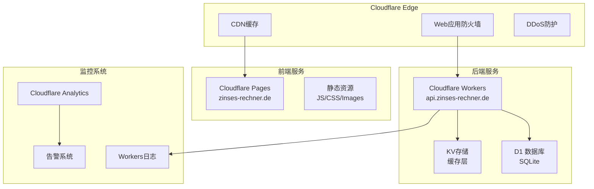

# Zinses-Rechner 运维手册

## 🎯 运维概览

本手册为 Zinses-Rechner 系统的日常运维提供详细指导，包括监控、维护、故障排查和应急响应流程。

## 🏗️ 系统架构概览

### 生产环境组件



### 关键服务清单

| 服务 | 类型 | 域名 | 状态检查 |
|------|------|------|----------|
| 前端应用 | Cloudflare Pages | zinses-rechner.de | `curl -I https://zinses-rechner.de` |
| API服务 | Cloudflare Workers | api.zinses-rechner.de | `curl https://api.zinses-rechner.de/health` |
| 数据库 | Cloudflare D1 | - | `npx wrangler d1 info zinses-rechner-prod` |
| 缓存 | Cloudflare KV | - | API健康检查包含 |
| 监控 | Cloudflare Analytics | - | Dashboard检查 |

## 📊 日常监控任务

### 每日检查清单 (5分钟)

```bash
#!/bin/bash
# scripts/daily-health-check.sh

echo "🔍 开始每日健康检查..."

# 1. 前端服务检查
echo "检查前端服务..."
FRONTEND_STATUS=$(curl -s -o /dev/null -w "%{http_code}" https://zinses-rechner.de)
if [ "$FRONTEND_STATUS" = "200" ]; then
    echo "✅ 前端服务正常"
else
    echo "❌ 前端服务异常: HTTP $FRONTEND_STATUS"
    # 发送告警
    ./scripts/send-alert.sh "前端服务异常" "HTTP状态码: $FRONTEND_STATUS"
fi

# 2. API服务检查
echo "检查API服务..."
API_RESPONSE=$(curl -s https://api.zinses-rechner.de/health)
API_STATUS=$(echo $API_RESPONSE | jq -r '.status // "error"')
if [ "$API_STATUS" = "healthy" ]; then
    echo "✅ API服务正常"
else
    echo "❌ API服务异常: $API_STATUS"
    ./scripts/send-alert.sh "API服务异常" "状态: $API_STATUS"
fi

# 3. 数据库连接检查
echo "检查数据库连接..."
DB_CHECK=$(npx wrangler d1 execute zinses-rechner-prod --env production --command="SELECT 1 as test" 2>&1)
if echo "$DB_CHECK" | grep -q "test"; then
    echo "✅ 数据库连接正常"
else
    echo "❌ 数据库连接异常"
    ./scripts/send-alert.sh "数据库连接异常" "错误: $DB_CHECK"
fi

# 4. 性能指标检查
echo "检查性能指标..."
RESPONSE_TIME=$(curl -w "%{time_total}" -s -o /dev/null https://api.zinses-rechner.de/api/v1/calculate/compound-interest \
    -X POST -H "Content-Type: application/json" \
    -d '{"principal": 10000, "annual_rate": 4, "years": 10}')

if (( $(echo "$RESPONSE_TIME < 1.0" | bc -l) )); then
    echo "✅ API响应时间正常: ${RESPONSE_TIME}s"
else
    echo "⚠️ API响应时间较慢: ${RESPONSE_TIME}s"
    ./scripts/send-alert.sh "API响应时间过慢" "响应时间: ${RESPONSE_TIME}s"
fi

echo "✅ 每日健康检查完成"
```

### 每周检查清单 (30分钟)

```markdown
## 每周运维检查清单

### 系统性能审查
- [ ] 检查过去7天的响应时间趋势
- [ ] 分析错误日志和异常模式
- [ ] 验证缓存命中率 (目标: >85%)
- [ ] 检查资源使用率趋势

### 安全状态检查
- [ ] 审查安全事件日志
- [ ] 检查WAF规则触发情况
- [ ] 验证SSL证书有效期 (>30天)
- [ ] 运行依赖漏洞扫描

### 数据和备份
- [ ] 验证数据库备份完整性
- [ ] 检查数据增长趋势
- [ ] 清理过期日志和临时文件
- [ ] 验证监控数据收集

### 用户体验
- [ ] 检查Core Web Vitals指标
- [ ] 分析用户反馈和支持请求
- [ ] 验证移动端体验
- [ ] 测试关键用户流程
```

### 每月检查清单 (2小时)

```bash
#!/bin/bash
# scripts/monthly-maintenance.sh

echo "🔧 开始每月维护任务..."

# 1. 依赖更新检查
echo "检查依赖更新..."
cd zinses-rechner-frontend
npm audit
npm outdated

cd ../cloudflare-workers/api-worker
npm audit
npm outdated

# 2. 安全扫描
echo "运行安全扫描..."
cd ../../security
./scripts/run-security-scan.sh full

# 3. 性能基准测试
echo "运行性能测试..."
cd ../scripts
./performance-benchmark.sh production

# 4. 数据库维护
echo "数据库维护..."
npx wrangler d1 execute zinses-rechner-prod --env production \
    --command="DELETE FROM calculation_history WHERE created_at < datetime('now', '-90 days')"

# 5. 监控配置审查
echo "审查监控配置..."
./monitoring/scripts/review-monitoring-config.sh

# 6. 生成月度报告
echo "生成月度运维报告..."
./generate-monthly-report.sh

echo "✅ 每月维护任务完成"
```

## 🚨 故障排查指南

### 紧急故障响应流程

**严重程度分级:**
- **P0 (Critical)**: 服务完全不可用 - 15分钟内响应
- **P1 (High)**: 核心功能受影响 - 2小时内响应  
- **P2 (Medium)**: 部分功能异常 - 8小时内响应
- **P3 (Low)**: 轻微问题 - 24小时内响应

**P0紧急响应流程:**
```bash
#!/bin/bash
# scripts/emergency-response.sh

echo "🚨 启动紧急响应流程..."

# 1. 立即诊断
echo "1. 快速诊断..."
curl -I https://zinses-rechner.de
curl -I https://api.zinses-rechner.de/health

# 2. 检查Cloudflare状态
echo "2. 检查Cloudflare状态..."
curl -s https://www.cloudflarestatus.com/api/v2/status.json | jq '.status.description'

# 3. 查看最近部署
echo "3. 检查最近部署..."
git log --oneline -5

# 4. 检查Workers日志
echo "4. 检查Workers日志..."
npx wrangler tail --env production --format=pretty | head -20

# 5. 评估回滚需要
echo "5. 评估是否需要回滚..."
read -p "是否需要立即回滚? (y/n): " rollback
if [ "$rollback" = "y" ]; then
    echo "执行紧急回滚..."
    npx wrangler rollback --env production
    echo "✅ 回滚完成，验证服务状态..."
    sleep 30
    curl https://api.zinses-rechner.de/health
fi

# 6. 通知团队
echo "6. 发送紧急通知..."
./scripts/send-emergency-alert.sh "P0故障" "服务不可用，正在处理"

echo "🚨 紧急响应流程完成"
```

### 常见故障诊断

#### 1. API响应时间过长

**症状识别:**
```bash
# 测试API响应时间
curl -w "@curl-format.txt" -o /dev/null -s \
    -X POST https://api.zinses-rechner.de/api/v1/calculate/compound-interest \
    -H "Content-Type: application/json" \
    -d '{"principal": 10000, "annual_rate": 4, "years": 10}'

# curl-format.txt内容:
#      time_namelookup:  %{time_namelookup}\n
#         time_connect:  %{time_connect}\n
#      time_appconnect:  %{time_appconnect}\n
#     time_pretransfer:  %{time_pretransfer}\n
#        time_redirect:  %{time_redirect}\n
#   time_starttransfer:  %{time_starttransfer}\n
#                      ----------\n
#           time_total:  %{time_total}\n
```

**诊断步骤:**
```bash
# 1. 检查Workers性能
npx wrangler tail --env production | grep -E "(duration|error|timeout)"

# 2. 检查数据库性能
npx wrangler d1 execute zinses-rechner-prod --env production \
    --command="SELECT COUNT(*) FROM calculation_history WHERE created_at > datetime('now', '-1 hour')"

# 3. 检查缓存命中率
curl https://api.zinses-rechner.de/api/v1/monitoring/cache-stats

# 4. 分析慢查询
./scripts/analyze-slow-queries.sh --hours=1
```

**解决方案:**
1. **优化数据库查询**: 添加索引，优化SQL
2. **增强缓存策略**: 延长缓存时间，预热热点数据
3. **代码优化**: 减少计算复杂度，异步处理
4. **资源扩容**: 调整Workers配置

#### 2. 前端页面加载缓慢

**诊断工具:**
```bash
# 1. Lighthouse性能分析
npx lighthouse https://zinses-rechner.de \
    --output=json \
    --output-path=reports/lighthouse-$(date +%Y%m%d).json

# 2. 分析关键指标
jq '.categories.performance.score, .audits["largest-contentful-paint"].numericValue' \
    reports/lighthouse-$(date +%Y%m%d).json

# 3. 检查资源加载
curl -w "@curl-format.txt" -o /dev/null -s https://zinses-rechner.de

# 4. 分析Bundle大小
cd zinses-rechner-frontend
npm run build -- --analyze
```

**优化措施:**
```typescript
// 1. 代码分割优化
const Calculator = defineAsyncComponent(() => import('./views/Calculator.vue'))
const Charts = defineAsyncComponent(() => import('./components/Charts.vue'))

// 2. 资源预加载
const preloadCriticalResources = () => {
    const link = document.createElement('link')
    link.rel = 'preload'
    link.href = '/api/v1/calculate/compound-interest'
    link.as = 'fetch'
    document.head.appendChild(link)
}

// 3. 图片优化
const getOptimizedImage = (src: string, width: number) => {
    return `https://imagedelivery.net/account/${src}/w=${width},f=webp`
}
```

#### 3. 数据库连接问题

**诊断步骤:**
```bash
# 1. 检查D1数据库状态
npx wrangler d1 info zinses-rechner-prod --env production

# 2. 测试数据库连接
npx wrangler d1 execute zinses-rechner-prod --env production \
    --command="SELECT 1 as test"

# 3. 检查数据库大小和性能
npx wrangler d1 execute zinses-rechner-prod --env production \
    --command="SELECT 
        COUNT(*) as total_records,
        MAX(created_at) as latest_record,
        MIN(created_at) as earliest_record
    FROM calculation_history"

# 4. 分析查询性能
npx wrangler d1 execute zinses-rechner-prod --env production \
    --command="EXPLAIN QUERY PLAN 
    SELECT * FROM calculation_history 
    WHERE created_at > datetime('now', '-1 day')"
```

**解决方案:**
```typescript
// 连接重试机制
export class DatabaseService {
    private async executeWithRetry<T>(
        operation: () => Promise<T>,
        maxRetries: number = 3
    ): Promise<T> {
        for (let attempt = 1; attempt <= maxRetries; attempt++) {
            try {
                return await operation()
            } catch (error) {
                if (attempt === maxRetries) throw error
                
                // 指数退避
                const delay = Math.pow(2, attempt) * 1000
                await new Promise(resolve => setTimeout(resolve, delay))
            }
        }
        throw new Error('Max retries exceeded')
    }
}
```

## 🔧 维护任务

### 数据库维护

**定期清理任务:**
```bash
#!/bin/bash
# scripts/database-maintenance.sh

echo "🗄️ 开始数据库维护..."

# 1. 清理过期数据 (保留90天)
npx wrangler d1 execute zinses-rechner-prod --env production \
    --command="DELETE FROM calculation_history WHERE created_at < datetime('now', '-90 days')"

# 2. 清理系统指标 (保留30天)
npx wrangler d1 execute zinses-rechner-prod --env production \
    --command="DELETE FROM system_metrics WHERE timestamp < datetime('now', '-30 days')"

# 3. 重建索引
npx wrangler d1 execute zinses-rechner-prod --env production \
    --command="REINDEX"

# 4. 分析表统计
npx wrangler d1 execute zinses-rechner-prod --env production \
    --command="ANALYZE"

# 5. 检查数据库大小
DB_SIZE=$(npx wrangler d1 info zinses-rechner-prod --env production | grep "Size" | awk '{print $2}')
echo "数据库大小: $DB_SIZE"

if [ "${DB_SIZE%MB}" -gt 500 ]; then
    echo "⚠️ 数据库大小超过500MB，考虑数据归档"
    ./scripts/send-alert.sh "数据库大小告警" "当前大小: $DB_SIZE"
fi

echo "✅ 数据库维护完成"
```

**数据备份策略:**
```bash
#!/bin/bash
# scripts/backup-database.sh

TIMESTAMP=$(date +%Y%m%d_%H%M%S)
BACKUP_DIR="backups/database"

mkdir -p "$BACKUP_DIR"

echo "📦 开始数据库备份..."

# 导出生产数据库
npx wrangler d1 export zinses-rechner-prod --env production \
    --output "$BACKUP_DIR/zinses-rechner-prod-$TIMESTAMP.sql"

# 压缩备份文件
gzip "$BACKUP_DIR/zinses-rechner-prod-$TIMESTAMP.sql"

# 上传到云存储 (可选)
if [ -n "$BACKUP_CLOUD_URL" ]; then
    aws s3 cp "$BACKUP_DIR/zinses-rechner-prod-$TIMESTAMP.sql.gz" \
        "$BACKUP_CLOUD_URL/database-backups/"
fi

# 清理旧备份 (保留30天)
find "$BACKUP_DIR" -name "*.sql.gz" -mtime +30 -delete

echo "✅ 数据库备份完成: $BACKUP_DIR/zinses-rechner-prod-$TIMESTAMP.sql.gz"
```

### 缓存管理

**缓存清理和预热:**
```bash
#!/bin/bash
# scripts/cache-management.sh

echo "🗂️ 开始缓存管理..."

# 1. 清理过期缓存
echo "清理过期缓存..."
npx wrangler kv:bulk delete --namespace-id="$KV_NAMESPACE_ID" \
    --preview=false \
    $(npx wrangler kv:key list --namespace-id="$KV_NAMESPACE_ID" | \
      jq -r '.[] | select(.expiration != null and (.expiration < now)) | .name')

# 2. 预热热点数据
echo "预热热点缓存..."
POPULAR_CALCULATIONS=(
    '{"principal": 10000, "annual_rate": 4, "years": 10}'
    '{"principal": 25000, "annual_rate": 5, "years": 15}'
    '{"principal": 50000, "annual_rate": 6, "years": 20}'
    '{"principal": 100000, "annual_rate": 4.5, "years": 25}'
)

for calc in "${POPULAR_CALCULATIONS[@]}"; do
    curl -s -X POST https://api.zinses-rechner.de/api/v1/calculate/compound-interest \
        -H "Content-Type: application/json" \
        -d "$calc" > /dev/null
    echo "预热计算: $calc"
done

# 3. 检查缓存统计
CACHE_STATS=$(curl -s https://api.zinses-rechner.de/api/v1/monitoring/cache-stats)
HIT_RATE=$(echo $CACHE_STATS | jq -r '.hit_rate')

echo "缓存命中率: $HIT_RATE%"

if (( $(echo "$HIT_RATE < 80" | bc -l) )); then
    echo "⚠️ 缓存命中率较低，需要优化"
    ./scripts/send-alert.sh "缓存命中率低" "当前命中率: $HIT_RATE%"
fi

echo "✅ 缓存管理完成"
```

### 日志管理

**日志收集和分析:**
```bash
#!/bin/bash
# scripts/log-analysis.sh

HOURS=${1:-24}
echo "📋 分析最近 $HOURS 小时的日志..."

# 1. 收集Workers日志
echo "收集Workers日志..."
npx wrangler tail --env production --format=json \
    --since="${HOURS}h" > logs/workers-$(date +%Y%m%d).json

# 2. 分析错误模式
echo "分析错误模式..."
cat logs/workers-$(date +%Y%m%d).json | \
    jq -r 'select(.level == "error") | .message' | \
    sort | uniq -c | sort -nr > logs/error-summary-$(date +%Y%m%d).txt

# 3. 分析性能指标
echo "分析性能指标..."
cat logs/workers-$(date +%Y%m%d).json | \
    jq -r 'select(.duration_ms != null) | .duration_ms' | \
    awk '{sum+=$1; count++} END {print "平均响应时间:", sum/count "ms"}' \
    > logs/performance-summary-$(date +%Y%m%d).txt

# 4. 检查异常IP
echo "检查异常IP活动..."
cat logs/workers-$(date +%Y%m%d).json | \
    jq -r '.client_ip' | sort | uniq -c | sort -nr | head -10 \
    > logs/top-ips-$(date +%Y%m%d).txt

# 5. 生成日志报告
echo "生成日志分析报告..."
./scripts/generate-log-report.sh $HOURS

echo "✅ 日志分析完成，报告保存在 logs/ 目录"
```

## 📈 性能优化

### 前端性能优化

**资源优化检查:**
```bash
#!/bin/bash
# scripts/frontend-optimization-check.sh

echo "⚡ 检查前端性能优化..."

cd zinses-rechner-frontend

# 1. 分析Bundle大小
echo "1. 分析Bundle大小..."
npm run build -- --analyze
BUNDLE_SIZE=$(du -sh dist/ | cut -f1)
echo "Bundle总大小: $BUNDLE_SIZE"

# 2. 检查未使用的依赖
echo "2. 检查未使用的依赖..."
npx depcheck

# 3. 检查重复依赖
echo "3. 检查重复依赖..."
npx npm-check-duplicates

# 4. 分析关键渲染路径
echo "4. 分析关键渲染路径..."
npx lighthouse https://zinses-rechner.de \
    --only-categories=performance \
    --output=json \
    --output-path=../reports/performance-$(date +%Y%m%d).json

# 5. 检查图片优化
echo "5. 检查图片优化..."
find public/ -name "*.png" -o -name "*.jpg" -o -name "*.jpeg" | \
    xargs -I {} sh -c 'echo "{}:" $(du -h "{}")'

echo "✅ 前端性能检查完成"
```

### 后端性能优化

**Workers性能监控:**
```typescript
// workers/performance-monitor.ts
export class WorkersPerformanceMonitor {
    static async measureEndpointPerformance(
        endpoint: string,
        handler: (request: Request) => Promise<Response>
    ): Promise<PerformanceReport> {
        const startTime = Date.now()
        const startCPU = performance.now()
        
        try {
            const response = await handler(request)
            const endTime = Date.now()
            const endCPU = performance.now()
            
            return {
                endpoint,
                duration_ms: endTime - startTime,
                cpu_time_ms: endCPU - startCPU,
                status_code: response.status,
                response_size: response.headers.get('content-length') || '0',
                timestamp: new Date().toISOString()
            }
        } catch (error) {
            return {
                endpoint,
                duration_ms: Date.now() - startTime,
                cpu_time_ms: performance.now() - startCPU,
                status_code: 500,
                error: error.message,
                timestamp: new Date().toISOString()
            }
        }
    }
}
```

## 🔒 安全运维

### 安全事件响应

**安全事件分类:**
```typescript
// security/incident-classifier.ts
export enum SecurityIncidentType {
    SQL_INJECTION = 'sql_injection',
    XSS_ATTEMPT = 'xss_attempt',
    BRUTE_FORCE = 'brute_force',
    DDoS_ATTACK = 'ddos_attack',
    SUSPICIOUS_ACTIVITY = 'suspicious_activity',
    DATA_BREACH = 'data_breach'
}

export enum IncidentSeverity {
    LOW = 'low',
    MEDIUM = 'medium',
    HIGH = 'high',
    CRITICAL = 'critical'
}

export interface SecurityIncident {
    id: string
    type: SecurityIncidentType
    severity: IncidentSeverity
    timestamp: string
    client_ip: string
    user_agent: string
    details: Record<string, any>
    status: 'open' | 'investigating' | 'resolved' | 'false_positive'
}
```

**自动响应机制:**
```bash
#!/bin/bash
# scripts/security-incident-response.sh

INCIDENT_TYPE=$1
SEVERITY=$2
CLIENT_IP=$3

echo "🛡️ 处理安全事件: $INCIDENT_TYPE (严重程度: $SEVERITY)"

case $SEVERITY in
    "critical")
        echo "🚨 Critical事件 - 立即阻止IP"
        # 在Cloudflare中阻止IP
        curl -X POST "https://api.cloudflare.com/client/v4/zones/$ZONE_ID/firewall/access_rules/rules" \
            -H "Authorization: Bearer $CF_API_TOKEN" \
            -H "Content-Type: application/json" \
            -d "{
                \"mode\": \"block\",
                \"configuration\": {
                    \"target\": \"ip\",
                    \"value\": \"$CLIENT_IP\"
                },
                \"notes\": \"Auto-blocked due to $INCIDENT_TYPE\"
            }"
        
        # 发送紧急告警
        ./scripts/send-emergency-alert.sh "Critical安全事件" "$INCIDENT_TYPE from $CLIENT_IP"
        ;;
        
    "high")
        echo "⚠️ High事件 - 限制IP访问"
        # 实施速率限制
        ./scripts/rate-limit-ip.sh "$CLIENT_IP" 3600 # 1小时限制
        
        # 发送告警
        ./scripts/send-alert.sh "High安全事件" "$INCIDENT_TYPE from $CLIENT_IP"
        ;;
        
    "medium"|"low")
        echo "📝 记录事件用于分析"
        # 记录到安全日志
        echo "$(date -Iseconds) [$SEVERITY] $INCIDENT_TYPE from $CLIENT_IP" >> logs/security-events.log
        ;;
esac

echo "✅ 安全事件处理完成"
```

### 定期安全检查

**每周安全审查:**
```bash
#!/bin/bash
# scripts/weekly-security-review.sh

echo "🔍 开始每周安全审查..."

# 1. 运行安全扫描
echo "1. 运行OWASP ZAP扫描..."
cd security
./scripts/run-security-scan.sh baseline

# 2. 检查依赖漏洞
echo "2. 检查依赖漏洞..."
cd ../zinses-rechner-frontend
npm audit --audit-level=high

cd ../cloudflare-workers/api-worker
npm audit --audit-level=high

# 3. 分析安全事件
echo "3. 分析安全事件..."
cd ../../
./scripts/analyze-security-events.sh --days=7

# 4. 检查SSL证书
echo "4. 检查SSL证书..."
SSL_EXPIRY=$(echo | openssl s_client -servername zinses-rechner.de -connect zinses-rechner.de:443 2>/dev/null | \
    openssl x509 -noout -dates | grep notAfter | cut -d= -f2)
echo "SSL证书到期时间: $SSL_EXPIRY"

# 5. 验证安全头
echo "5. 验证安全头..."
curl -I https://zinses-rechner.de | grep -E "(X-Frame-Options|X-Content-Type-Options|Strict-Transport-Security)"

# 6. 生成安全报告
echo "6. 生成安全报告..."
./scripts/generate-security-report.sh --weekly

echo "✅ 每周安全审查完成"
```

## 📊 监控和告警

### 关键指标监控

**系统健康指标:**
```typescript
// monitoring/health-metrics.ts
export interface HealthMetrics {
    // 服务可用性
    uptime_percentage: number
    response_time_p95: number
    error_rate_percentage: number
    
    // 业务指标
    calculations_per_hour: number
    unique_users_daily: number
    conversion_rate: number
    
    // 技术指标
    cache_hit_rate: number
    database_connections: number
    memory_usage_mb: number
    cpu_usage_percentage: number
}

export const healthThresholds = {
    uptime_percentage: { warning: 99.5, critical: 99.0 },
    response_time_p95: { warning: 1000, critical: 2000 },
    error_rate_percentage: { warning: 0.5, critical: 1.0 },
    cache_hit_rate: { warning: 80, critical: 70 },
    cpu_usage_percentage: { warning: 80, critical: 90 },
    memory_usage_mb: { warning: 100, critical: 120 }
}
```

**告警规则配置:**
```yaml
# monitoring/alert-rules.yml
alert_rules:
  - name: "API响应时间过高"
    metric: "response_time_p95"
    condition: "greater_than"
    threshold: 1000
    duration_minutes: 5
    severity: "warning"
    channels: ["slack", "email"]
    
  - name: "错误率过高"
    metric: "error_rate_percentage"
    condition: "greater_than"
    threshold: 1.0
    duration_minutes: 3
    severity: "critical"
    channels: ["slack", "email", "pagerduty"]
    
  - name: "服务不可用"
    metric: "uptime_percentage"
    condition: "less_than"
    threshold: 99.0
    duration_minutes: 1
    severity: "critical"
    channels: ["slack", "email", "pagerduty"]
```

### 告警通知配置

**Slack集成:**
```bash
#!/bin/bash
# scripts/send-alert.sh

ALERT_TITLE=$1
ALERT_MESSAGE=$2
SEVERITY=${3:-"warning"}

# 设置颜色
case $SEVERITY in
    "critical") COLOR="danger" ;;
    "warning") COLOR="warning" ;;
    *) COLOR="good" ;;
esac

# 发送Slack通知
curl -X POST "$SLACK_WEBHOOK_URL" \
    -H 'Content-type: application/json' \
    -d "{
        \"text\": \"🚨 $ALERT_TITLE\",
        \"attachments\": [{
            \"color\": \"$COLOR\",
            \"fields\": [
                {\"title\": \"消息\", \"value\": \"$ALERT_MESSAGE\", \"short\": false},
                {\"title\": \"时间\", \"value\": \"$(date -Iseconds)\", \"short\": true},
                {\"title\": \"环境\", \"value\": \"Production\", \"short\": true}
            ],
            \"actions\": [
                {\"type\": \"button\", \"text\": \"查看仪表盘\", \"url\": \"https://monitoring.zinses-rechner.de\"},
                {\"type\": \"button\", \"text\": \"查看日志\", \"url\": \"https://dash.cloudflare.com\"}
            ]
        }]
    }"

# 记录告警历史
echo "$(date -Iseconds) [$SEVERITY] $ALERT_TITLE: $ALERT_MESSAGE" >> logs/alerts.log
```

## 🔄 部署和回滚

### 部署流程

**标准部署流程:**
```bash
#!/bin/bash
# scripts/deploy-production.sh

echo "🚀 开始生产环境部署..."

# 1. 预部署检查
echo "1. 预部署检查..."
./scripts/pre-deployment-check.sh
if [ $? -ne 0 ]; then
    echo "❌ 预部署检查失败，停止部署"
    exit 1
fi

# 2. 备份当前版本
echo "2. 备份当前版本..."
CURRENT_VERSION=$(git rev-parse HEAD)
echo $CURRENT_VERSION > backups/last-deployed-version.txt

# 3. 部署API
echo "3. 部署API到Workers..."
cd cloudflare-workers/api-worker
npx wrangler deploy --env production

# 4. 部署前端
echo "4. 部署前端到Pages..."
cd ../../zinses-rechner-frontend
npm run build
npx wrangler pages deploy dist --project-name=zinses-rechner

# 5. 验证部署
echo "5. 验证部署..."
sleep 30 # 等待部署生效
./scripts/verify-deployment.sh production

if [ $? -eq 0 ]; then
    echo "✅ 部署成功"
    ./scripts/send-alert.sh "部署成功" "版本 $CURRENT_VERSION 已成功部署到生产环境" "good"
else
    echo "❌ 部署验证失败，考虑回滚"
    ./scripts/send-alert.sh "部署验证失败" "版本 $CURRENT_VERSION 部署后验证失败" "danger"
    exit 1
fi
```

**快速回滚流程:**
```bash
#!/bin/bash
# scripts/emergency-rollback.sh

echo "🔄 开始紧急回滚..."

# 1. 回滚Workers
echo "1. 回滚Workers..."
npx wrangler rollback --env production

# 2. 回滚前端 (通过Git)
echo "2. 回滚前端..."
LAST_VERSION=$(cat backups/last-deployed-version.txt)
git checkout $LAST_VERSION
cd zinses-rechner-frontend
npm run build
npx wrangler pages deploy dist --project-name=zinses-rechner

# 3. 验证回滚
echo "3. 验证回滚..."
sleep 30
./scripts/verify-deployment.sh production

if [ $? -eq 0 ]; then
    echo "✅ 回滚成功"
    ./scripts/send-alert.sh "紧急回滚成功" "系统已回滚到版本 $LAST_VERSION" "good"
else
    echo "❌ 回滚失败，需要手动干预"
    ./scripts/send-emergency-alert.sh "回滚失败" "紧急回滚失败，需要立即人工干预"
fi
```

## 📋 运维检查清单

### 每日运维清单 (10分钟)

```markdown
## 每日运维检查清单

### 系统健康 (2分钟)
- [ ] 前端服务可访问 (zinses-rechner.de)
- [ ] API服务健康检查通过
- [ ] 数据库连接正常
- [ ] 无Critical级别告警

### 性能指标 (3分钟)
- [ ] API响应时间 < 500ms (P95)
- [ ] 前端LCP < 2.5秒
- [ ] 缓存命中率 > 85%
- [ ] 错误率 < 0.1%

### 安全状态 (2分钟)
- [ ] 无新的安全告警
- [ ] WAF规则正常运行
- [ ] SSL证书有效期 > 30天
- [ ] 无异常IP活动

### 业务指标 (3分钟)
- [ ] 计算成功率 > 99.9%
- [ ] 用户活跃度正常
- [ ] 无用户投诉或问题报告
- [ ] 监控数据收集正常
```

### 每周运维清单 (1小时)

```markdown
## 每周运维检查清单

### 性能分析 (20分钟)
- [ ] 分析过去7天的性能趋势
- [ ] 检查Core Web Vitals变化
- [ ] 分析慢查询和性能瓶颈
- [ ] 评估缓存策略效果

### 安全审查 (20分钟)
- [ ] 运行完整安全扫描
- [ ] 分析安全事件日志
- [ ] 检查依赖漏洞
- [ ] 验证安全配置

### 数据管理 (10分钟)
- [ ] 验证数据库备份
- [ ] 清理过期数据
- [ ] 检查数据增长趋势
- [ ] 验证数据完整性

### 系统维护 (10分钟)
- [ ] 检查系统资源使用
- [ ] 清理临时文件和日志
- [ ] 更新系统文档
- [ ] 计划必要的维护窗口
```

## 🆘 应急联系信息

### 团队联系方式

**技术团队:**
- **技术负责人**: tech@zinses-rechner.de
- **运维负责人**: ops@zinses-rechner.de
- **安全负责人**: security@zinses-rechner.de

**紧急联系:**
- **24/7热线**: +49-xxx-xxx-xxxx
- **Slack频道**: #zinses-rechner-alerts
- **PagerDuty**: zinses-rechner-oncall

### 外部服务支持

**Cloudflare:**
- **状态页面**: https://www.cloudflarestatus.com
- **支持文档**: https://developers.cloudflare.com
- **企业支持**: (如果适用)

**GitHub:**
- **状态页面**: https://www.githubstatus.com
- **支持文档**: https://docs.github.com

### 升级路径

**事件升级流程:**
1. **L1 (运维工程师)**: 初始响应和基础诊断
2. **L2 (高级工程师)**: 深度技术分析和修复
3. **L3 (架构师/CTO)**: 架构级问题和重大决策
4. **外部专家**: 特殊情况下的专业支持

## 📈 容量规划

### 资源使用监控

**当前资源限制:**
- **Cloudflare Workers**: 100,000 requests/day (免费版)
- **Cloudflare D1**: 5GB storage, 25M reads/month
- **Cloudflare KV**: 100,000 reads/day
- **Cloudflare Pages**: 500 builds/month

**扩容触发条件:**
- Workers请求量 > 80,000/day
- D1存储使用 > 4GB
- KV读取量 > 80,000/day
- 响应时间持续 > 1秒

**扩容计划:**
```bash
#!/bin/bash
# scripts/capacity-planning.sh

echo "📊 分析容量使用情况..."

# 1. 检查Workers使用量
WORKERS_USAGE=$(curl -s -H "Authorization: Bearer $CF_API_TOKEN" \
    "https://api.cloudflare.com/client/v4/accounts/$ACCOUNT_ID/workers/usage" | \
    jq -r '.result.requests.current')

echo "Workers请求量: $WORKERS_USAGE"

# 2. 检查D1使用量
D1_SIZE=$(npx wrangler d1 info zinses-rechner-prod --env production | \
    grep "Size" | awk '{print $2}' | sed 's/MB//')

echo "D1数据库大小: ${D1_SIZE}MB"

# 3. 预测增长
GROWTH_RATE=1.2 # 20%月增长
MONTHS_TO_LIMIT=$(echo "scale=1; (5000 - $D1_SIZE) / ($D1_SIZE * ($GROWTH_RATE - 1))" | bc)

echo "预计 $MONTHS_TO_LIMIT 个月后达到D1存储限制"

if (( $(echo "$MONTHS_TO_LIMIT < 3" | bc -l) )); then
    echo "⚠️ 需要考虑扩容或数据归档"
    ./scripts/send-alert.sh "容量告警" "预计${MONTHS_TO_LIMIT}个月后达到存储限制"
fi
```

---

*运维手册版本: 1.0.0 | 最后更新: 2024-01-15*
