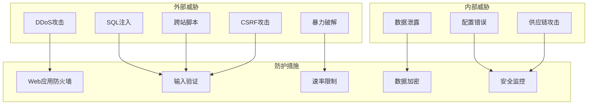
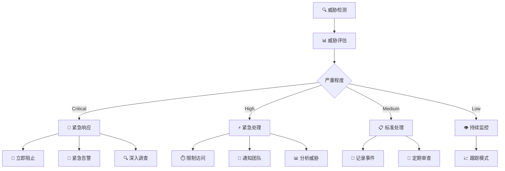

# Zinses-Rechner 安全指南

## 🛡️ 安全概览

Zinses-Rechner 实施了全面的安全措施，确保用户数据安全和系统稳定性。本文档详细说明了安全架构、威胁模型和安全最佳实践。

## 🎯 安全目标

### 核心安全原则

1. **数据最小化**: 仅收集必要的计算数据
2. **隐私保护**: 严格遵守 DSGVO 规定
3. **零信任架构**: 验证每个请求和用户输入
4. **纵深防御**: 多层安全防护机制
5. **透明度**: 开源安全配置和审计

### 威胁模型



## 🔒 安全实施

### 1. 网络层安全

**Cloudflare WAF 规则:**
```bash
# 启用 OWASP Core Ruleset
# Dashboard > Security > WAF > Managed Rules
# 启用: Cloudflare Managed Ruleset
# 启用: Cloudflare OWASP Core Ruleset

# 自定义规则示例
curl -X POST "https://api.cloudflare.com/client/v4/zones/$ZONE_ID/rulesets" \
  -H "Authorization: Bearer $API_TOKEN" \
  -d '{
    "name": "Zinses-Rechner Security Rules",
    "kind": "zone",
    "phase": "http_request_firewall_custom",
    "rules": [
      {
        "action": "block",
        "expression": "(http.user_agent contains \"sqlmap\") or (http.user_agent contains \"nikto\")",
        "description": "Block security scanners"
      },
      {
        "action": "challenge",
        "expression": "(cf.threat_score gt 10)",
        "description": "Challenge suspicious traffic"
      }
    ]
  }'
```

**DDoS 防护配置:**
```bash
# 启用 DDoS 防护
# Dashboard > Security > DDoS
# 设置敏感度: High
# 启用: Attack alerting
```

### 2. 应用层安全

**Content Security Policy (CSP):**
```typescript
// security/csp-config.ts
export const cspConfig = {
  'default-src': ["'self'"],
  'script-src': [
    "'self'",
    "'unsafe-inline'", // 仅开发环境
    "https://cdn.jsdelivr.net",
    "https://unpkg.com"
  ],
  'style-src': [
    "'self'",
    "'unsafe-inline'",
    "https://fonts.googleapis.com"
  ],
  'img-src': [
    "'self'",
    "data:",
    "https:"
  ],
  'font-src': [
    "'self'",
    "https://fonts.gstatic.com"
  ],
  'connect-src': [
    "'self'",
    "https://api.zinses-rechner.de"
  ],
  'frame-src': ["'none'"],
  'object-src': ["'none'"],
  'base-uri': ["'self'"],
  'form-action': ["'self'"],
  'frame-ancestors': ["'none'"],
  'report-uri': "/api/v1/security/csp-report"
}
```

**安全头配置:**
```typescript
// workers/security-headers.ts
export const securityHeaders = {
  'Strict-Transport-Security': 'max-age=31536000; includeSubDomains; preload',
  'X-Frame-Options': 'DENY',
  'X-Content-Type-Options': 'nosniff',
  'Referrer-Policy': 'strict-origin-when-cross-origin',
  'Permissions-Policy': 'camera=(), microphone=(), geolocation=()',
  'X-XSS-Protection': '1; mode=block',
  'Content-Security-Policy': generateCSP(cspConfig)
}
```

### 3. 输入验证和净化

**输入验证架构:**
```typescript
// security/input-validator.ts
export class InputValidator {
  private static readonly SQL_INJECTION_PATTERNS = [
    /(\b(SELECT|INSERT|UPDATE|DELETE|DROP|CREATE|ALTER|EXEC|UNION)\b)/i,
    /(\b(OR|AND)\s+\d+\s*=\s*\d+)/i,
    /(--|\/\*|\*\/|;)/,
    /(\b(SCRIPT|JAVASCRIPT|VBSCRIPT|ONLOAD|ONERROR|ONCLICK)\b)/i
  ]

  private static readonly XSS_PATTERNS = [
    /<script\b[^<]*(?:(?!<\/script>)<[^<]*)*<\/script>/gi,
    /<iframe\b[^<]*(?:(?!<\/iframe>)<[^<]*)*<\/iframe>/gi,
    /javascript:/gi,
    /on\w+\s*=/gi
  ]

  static validateCalculationInput(input: CalculationRequest): ValidationResult {
    const errors: string[] = []

    // 数值范围验证
    if (input.principal < 1 || input.principal > 10000000) {
      errors.push('Das Startkapital muss zwischen 1€ und 10.000.000€ liegen.')
    }

    if (input.annual_rate < 0 || input.annual_rate > 20) {
      errors.push('Der Zinssatz muss zwischen 0% und 20% liegen.')
    }

    if (input.years < 1 || input.years > 50) {
      errors.push('Die Laufzeit muss zwischen 1 und 50 Jahren liegen.')
    }

    // 安全检查
    const inputString = JSON.stringify(input)
    
    if (this.detectSQLInjection(inputString)) {
      errors.push('Ungültige Eingabe erkannt.')
      this.logSecurityEvent('sql_injection_attempt', input)
    }

    if (this.detectXSS(inputString)) {
      errors.push('Ungültige Eingabe erkannt.')
      this.logSecurityEvent('xss_attempt', input)
    }

    return {
      valid: errors.length === 0,
      errors,
      sanitized: this.sanitizeInput(input)
    }
  }

  private static detectSQLInjection(input: string): boolean {
    return this.SQL_INJECTION_PATTERNS.some(pattern => pattern.test(input))
  }

  private static detectXSS(input: string): boolean {
    return this.XSS_PATTERNS.some(pattern => pattern.test(input))
  }

  private static sanitizeInput(input: any): any {
    // 递归净化所有字符串字段
    if (typeof input === 'string') {
      return input
        .replace(/</g, '&lt;')
        .replace(/>/g, '&gt;')
        .replace(/"/g, '&quot;')
        .replace(/'/g, '&#x27;')
        .trim()
    }
    
    if (typeof input === 'object' && input !== null) {
      const sanitized: any = {}
      for (const [key, value] of Object.entries(input)) {
        sanitized[key] = this.sanitizeInput(value)
      }
      return sanitized
    }
    
    return input
  }

  private static logSecurityEvent(eventType: string, payload: any): void {
    console.warn(`[SECURITY] ${eventType}:`, {
      timestamp: new Date().toISOString(),
      type: eventType,
      payload: JSON.stringify(payload),
      ip: 'masked', // IP地址已脱敏
      userAgent: 'masked' // User-Agent已脱敏
    })
  }
}
```

### 4. 速率限制

**多层速率限制:**
```typescript
// security/rate-limiter.ts
export class RateLimiter {
  private static readonly LIMITS = {
    global: { windowMs: 15 * 60 * 1000, maxRequests: 100 },
    calculation: { windowMs: 15 * 60 * 1000, maxRequests: 50 },
    health: { windowMs: 15 * 60 * 1000, maxRequests: 200 }
  }

  static async checkRateLimit(
    request: Request, 
    limitType: keyof typeof this.LIMITS,
    env: Env
  ): Promise<{ allowed: boolean; remaining: number; resetTime: number }> {
    const clientIP = request.headers.get('CF-Connecting-IP') || 'unknown'
    const limit = this.LIMITS[limitType]
    
    const key = `rate_limit:${limitType}:${clientIP}`
    const now = Date.now()
    const windowStart = now - limit.windowMs
    
    // 获取当前窗口内的请求计数
    const currentCount = await this.getRequestCount(env.KV, key, windowStart)
    
    if (currentCount >= limit.maxRequests) {
      return {
        allowed: false,
        remaining: 0,
        resetTime: windowStart + limit.windowMs
      }
    }
    
    // 记录新请求
    await this.recordRequest(env.KV, key, now)
    
    return {
      allowed: true,
      remaining: limit.maxRequests - currentCount - 1,
      resetTime: windowStart + limit.windowMs
    }
  }

  private static async getRequestCount(kv: KVNamespace, key: string, windowStart: number): Promise<number> {
    const data = await kv.get(key, 'json') as number[] || []
    return data.filter(timestamp => timestamp > windowStart).length
  }

  private static async recordRequest(kv: KVNamespace, key: string, timestamp: number): Promise<void> {
    const data = await kv.get(key, 'json') as number[] || []
    data.push(timestamp)
    
    // 保留最近的请求记录
    const recentRequests = data.filter(ts => ts > timestamp - 24 * 60 * 60 * 1000)
    
    await kv.put(key, JSON.stringify(recentRequests), { expirationTtl: 24 * 60 * 60 })
  }
}
```

## 🔐 数据保护

### 1. 数据加密

**传输加密:**
- 强制 HTTPS (TLS 1.3)
- HSTS 预加载
- 证书透明度监控

**存储加密:**
```typescript
// security/encryption.ts
export class DataEncryption {
  private static readonly ALGORITHM = 'AES-256-GCM'
  
  static async encryptSensitiveData(data: string, key: string): Promise<string> {
    const encoder = new TextEncoder()
    const keyBuffer = await crypto.subtle.importKey(
      'raw',
      encoder.encode(key),
      { name: 'AES-GCM' },
      false,
      ['encrypt']
    )
    
    const iv = crypto.getRandomValues(new Uint8Array(12))
    const encrypted = await crypto.subtle.encrypt(
      { name: 'AES-GCM', iv },
      keyBuffer,
      encoder.encode(data)
    )
    
    // 返回 IV + 加密数据的 Base64 编码
    const combined = new Uint8Array(iv.length + encrypted.byteLength)
    combined.set(iv)
    combined.set(new Uint8Array(encrypted), iv.length)
    
    return btoa(String.fromCharCode(...combined))
  }
  
  static async decryptSensitiveData(encryptedData: string, key: string): Promise<string> {
    const decoder = new TextDecoder()
    const combined = new Uint8Array(
      atob(encryptedData).split('').map(char => char.charCodeAt(0))
    )
    
    const iv = combined.slice(0, 12)
    const encrypted = combined.slice(12)
    
    const keyBuffer = await crypto.subtle.importKey(
      'raw',
      new TextEncoder().encode(key),
      { name: 'AES-GCM' },
      false,
      ['decrypt']
    )
    
    const decrypted = await crypto.subtle.decrypt(
      { name: 'AES-GCM', iv },
      keyBuffer,
      encrypted
    )
    
    return decoder.decode(decrypted)
  }
}
```

### 2. 数据匿名化

**IP 地址处理:**
```typescript
// security/anonymization.ts
export class DataAnonymizer {
  static hashIP(ip: string): string {
    // 使用 SHA-256 哈希 IP 地址
    const encoder = new TextEncoder()
    const data = encoder.encode(ip + process.env.SALT)
    
    return crypto.subtle.digest('SHA-256', data)
      .then(hash => Array.from(new Uint8Array(hash))
        .map(b => b.toString(16).padStart(2, '0'))
        .join('')
      )
  }
  
  static anonymizeUserAgent(userAgent: string): string {
    // 保留浏览器类型，移除版本和系统信息
    return userAgent
      .replace(/\d+\.\d+\.\d+/g, 'X.X.X')
      .replace(/\([^)]*\)/g, '(anonymized)')
  }
  
  static createSessionHash(ip: string, userAgent: string): string {
    const sessionData = `${ip}:${userAgent}:${Date.now()}`
    return this.hashIP(sessionData)
  }
}
```

## 🚨 安全监控

### 1. 实时威胁检测

**安全事件监控:**
```typescript
// security/threat-detector.ts
export class ThreatDetector {
  private static readonly SUSPICIOUS_PATTERNS = {
    sqlInjection: [
      /union\s+select/i,
      /drop\s+table/i,
      /exec\s*\(/i,
      /script\s*:/i
    ],
    xss: [
      /<script[^>]*>/i,
      /javascript:/i,
      /on\w+\s*=/i,
      /<iframe[^>]*>/i
    ],
    pathTraversal: [
      /\.\.\//,
      /\.\.\\\/,
      /%2e%2e%2f/i,
      /%252e%252e%252f/i
    ]
  }

  static analyzeRequest(request: Request): ThreatAnalysis {
    const url = new URL(request.url)
    const userAgent = request.headers.get('User-Agent') || ''
    
    const threats: string[] = []
    
    // 检查 URL 参数
    for (const [key, value] of url.searchParams) {
      if (this.containsSQLInjection(value)) {
        threats.push('sql_injection_in_params')
      }
      if (this.containsXSS(value)) {
        threats.push('xss_in_params')
      }
      if (this.containsPathTraversal(value)) {
        threats.push('path_traversal_in_params')
      }
    }
    
    // 检查 User-Agent
    if (this.isSuspiciousUserAgent(userAgent)) {
      threats.push('suspicious_user_agent')
    }
    
    return {
      threatLevel: threats.length > 0 ? 'high' : 'low',
      detectedThreats: threats,
      riskScore: this.calculateRiskScore(threats),
      recommendation: threats.length > 0 ? 'block' : 'allow'
    }
  }

  private static containsSQLInjection(input: string): boolean {
    return this.SUSPICIOUS_PATTERNS.sqlInjection.some(pattern => pattern.test(input))
  }

  private static containsXSS(input: string): boolean {
    return this.SUSPICIOUS_PATTERNS.xss.some(pattern => pattern.test(input))
  }

  private static containsPathTraversal(input: string): boolean {
    return this.SUSPICIOUS_PATTERNS.pathTraversal.some(pattern => pattern.test(input))
  }

  private static isSuspiciousUserAgent(userAgent: string): boolean {
    const suspiciousAgents = [
      /sqlmap/i, /nikto/i, /nessus/i, /burp/i, /zap/i,
      /wget/i, /curl/i, /python/i, /scanner/i
    ]
    return suspiciousAgents.some(pattern => pattern.test(userAgent))
  }

  private static calculateRiskScore(threats: string[]): number {
    const weights = {
      sql_injection_in_params: 10,
      xss_in_params: 8,
      path_traversal_in_params: 6,
      suspicious_user_agent: 4
    }
    
    return threats.reduce((score, threat) => {
      return score + (weights[threat as keyof typeof weights] || 1)
    }, 0)
  }
}
```

### 2. 安全事件响应

**自动响应机制:**
```typescript
// security/incident-response.ts
export class IncidentResponse {
  static async handleSecurityEvent(event: SecurityEvent, env: Env): Promise<void> {
    // 记录安全事件
    await this.logSecurityEvent(event, env)
    
    // 根据威胁级别采取行动
    switch (event.severity) {
      case 'critical':
        await this.handleCriticalThreat(event, env)
        break
      case 'high':
        await this.handleHighThreat(event, env)
        break
      case 'medium':
        await this.handleMediumThreat(event, env)
        break
      default:
        await this.handleLowThreat(event, env)
    }
  }

  private static async handleCriticalThreat(event: SecurityEvent, env: Env): Promise<void> {
    // 立即阻止IP
    await this.blockIP(event.clientIP, 24 * 60 * 60, env) // 24小时
    
    // 发送紧急告警
    await this.sendEmergencyAlert(event)
    
    // 记录到安全日志
    console.error('[CRITICAL SECURITY EVENT]', event)
  }

  private static async handleHighThreat(event: SecurityEvent, env: Env): Promise<void> {
    // 临时限制IP
    await this.rateLimitIP(event.clientIP, 60 * 60, env) // 1小时严格限制
    
    // 发送告警
    await this.sendSecurityAlert(event)
  }

  private static async sendSecurityAlert(event: SecurityEvent): Promise<void> {
    const alertPayload = {
      text: `🚨 安全事件检测: ${event.type}`,
      attachments: [
        {
          color: event.severity === 'critical' ? 'danger' : 'warning',
          fields: [
            { title: 'IP地址', value: event.clientIP, short: true },
            { title: '事件类型', value: event.type, short: true },
            { title: '严重程度', value: event.severity, short: true },
            { title: '时间', value: event.timestamp, short: true }
          ],
          footer: 'Zinses-Rechner 安全监控'
        }
      ]
    }

    // 发送到 Slack
    if (process.env.SLACK_SECURITY_WEBHOOK) {
      await fetch(process.env.SLACK_SECURITY_WEBHOOK, {
        method: 'POST',
        headers: { 'Content-Type': 'application/json' },
        body: JSON.stringify(alertPayload)
      })
    }
  }
}
```

## 🔍 安全审计

### 1. 自动化安全扫描

**OWASP ZAP 配置:**
```yaml
# security/owasp-zap-config.yml
env:
  contexts:
    - name: "Zinses-Rechner"
      urls:
        - "https://zinses-rechner.de"
        - "https://api.zinses-rechner.de"
      includePaths:
        - "https://zinses-rechner.de/.*"
        - "https://api.zinses-rechner.de/.*"
      excludePaths:
        - "https://api.zinses-rechner.de/test/.*"

rules:
  - id: 10020 # Missing Anti-clickjacking Header
    threshold: "Low"
  - id: 10021 # X-Content-Type-Options Header Missing
    threshold: "Low"
  - id: 10023 # Information Disclosure - Debug Error Messages
    threshold: "Medium"
  - id: 40012 # Cross Domain Script Inclusion
    threshold: "High"
  - id: 40014 # Cross Domain Misconfiguration
    threshold: "Medium"
  - id: 40016 # Cross Domain JavaScript Source File Inclusion
    threshold: "Medium"
  - id: 40017 # Source Code Disclosure
    threshold: "High"
```

**依赖漏洞扫描:**
```bash
# 前端依赖扫描
cd zinses-rechner-frontend
npm audit --audit-level=high
npm audit fix

# 使用 Snyk 进行深度扫描
npx snyk test
npx snyk monitor

# API Worker 依赖扫描
cd ../cloudflare-workers/api-worker
npm audit --audit-level=high
npx snyk test
```

### 2. 安全测试

**渗透测试清单:**
```markdown
## 手动安全测试清单

### 输入验证测试
- [ ] SQL 注入测试 (所有输入字段)
- [ ] XSS 测试 (反射型和存储型)
- [ ] CSRF 测试 (所有状态改变操作)
- [ ] 文件上传测试 (如果适用)
- [ ] 参数污染测试

### 认证和授权测试
- [ ] 会话管理测试
- [ ] 权限提升测试
- [ ] 会话固定测试
- [ ] 并发会话测试

### 业务逻辑测试
- [ ] 计算逻辑绕过测试
- [ ] 数值溢出测试
- [ ] 负数输入测试
- [ ] 极值边界测试

### 配置安全测试
- [ ] 安全头验证
- [ ] SSL/TLS 配置测试
- [ ] CORS 策略验证
- [ ] 错误信息泄露测试
```

## 📋 安全合规

### 1. DSGVO 合规

**数据处理原则:**
```typescript
// privacy/gdpr-compliance.ts
export class GDPRCompliance {
  static readonly DATA_RETENTION_DAYS = 30
  static readonly ANONYMIZATION_DELAY_HOURS = 24

  static async processCalculationData(data: CalculationRequest, clientInfo: ClientInfo): Promise<void> {
    // 1. 数据最小化
    const minimizedData = this.minimizeData(data)
    
    // 2. 立即匿名化
    const anonymizedData = {
      ...minimizedData,
      session_id: await DataAnonymizer.createSessionHash(clientInfo.ip, clientInfo.userAgent),
      ip_hash: await DataAnonymizer.hashIP(clientInfo.ip),
      user_agent_hash: await DataAnonymizer.anonymizeUserAgent(clientInfo.userAgent)
    }
    
    // 3. 存储匿名化数据
    await this.storeAnonymizedData(anonymizedData)
    
    // 4. 设置自动删除
    await this.scheduleDataDeletion(anonymizedData.session_id, this.DATA_RETENTION_DAYS)
  }

  private static minimizeData(data: CalculationRequest): Partial<CalculationRequest> {
    // 只保留计算必需的数据
    return {
      principal: Math.round(data.principal), // 四舍五入，减少精度
      annual_rate: Math.round(data.annual_rate * 100) / 100, // 保留2位小数
      years: data.years,
      monthly_payment: data.monthly_payment ? Math.round(data.monthly_payment) : 0,
      compound_frequency: data.compound_frequency || 'monthly'
    }
  }
}
```

**用户权利实现:**
```typescript
// privacy/user-rights.ts
export class UserRights {
  // 数据可携带权 (Art. 20 DSGVO)
  static async exportUserData(sessionId: string): Promise<UserDataExport> {
    const calculations = await db.getCalculationsBySession(sessionId)
    
    return {
      export_date: new Date().toISOString(),
      data_type: 'calculation_history',
      calculations: calculations.map(calc => ({
        date: calc.created_at,
        parameters: {
          principal: calc.principal,
          annual_rate: calc.annual_rate,
          years: calc.years,
          monthly_payment: calc.monthly_payment
        },
        result: {
          final_amount: calc.final_amount,
          total_interest: calc.total_interest
        }
      }))
    }
  }

  // 删除权 (Art. 17 DSGVO)
  static async deleteUserData(sessionId: string): Promise<DeletionResult> {
    const deletedCount = await db.deleteCalculationsBySession(sessionId)
    
    return {
      deleted: deletedCount > 0,
      records_deleted: deletedCount,
      deletion_date: new Date().toISOString()
    }
  }
}
```

### 2. 安全审计日志

**审计日志格式:**
```typescript
// security/audit-logger.ts
export interface AuditLogEntry {
  timestamp: string
  event_type: 'calculation' | 'security_event' | 'admin_action' | 'data_access'
  severity: 'info' | 'warning' | 'error' | 'critical'
  client_ip_hash: string
  user_agent_hash: string
  session_id: string
  action: string
  resource: string
  result: 'success' | 'failure' | 'blocked'
  details?: Record<string, any>
}

export class AuditLogger {
  static async logEvent(entry: Omit<AuditLogEntry, 'timestamp'>): Promise<void> {
    const auditEntry: AuditLogEntry = {
      ...entry,
      timestamp: new Date().toISOString()
    }
    
    // 记录到结构化日志
    console.log('[AUDIT]', JSON.stringify(auditEntry))
    
    // 存储到数据库（用于合规报告）
    await db.insertAuditLog(auditEntry)
    
    // 高危事件立即告警
    if (entry.severity === 'critical' || entry.severity === 'error') {
      await this.sendSecurityAlert(auditEntry)
    }
  }

  static async generateComplianceReport(startDate: Date, endDate: Date): Promise<ComplianceReport> {
    const auditLogs = await db.getAuditLogs(startDate, endDate)
    
    return {
      report_period: {
        start: startDate.toISOString(),
        end: endDate.toISOString()
      },
      total_events: auditLogs.length,
      events_by_type: this.groupByEventType(auditLogs),
      security_incidents: auditLogs.filter(log => log.severity === 'critical' || log.severity === 'error'),
      data_access_summary: this.summarizeDataAccess(auditLogs),
      compliance_status: 'compliant'
    }
  }
}
```

## 🔧 安全配置管理

### 1. 环境特定配置

**生产环境安全配置:**
```typescript
// config/security.production.ts
export const productionSecurityConfig = {
  csp: {
    reportOnly: false,
    reportUri: '/api/v1/security/csp-report'
  },
  rateLimit: {
    strict: true,
    windowMs: 15 * 60 * 1000,
    maxRequests: 100
  },
  logging: {
    level: 'info',
    sensitiveDataMasking: true,
    auditTrail: true
  },
  encryption: {
    algorithm: 'AES-256-GCM',
    keyRotationDays: 90
  }
}
```

**开发环境安全配置:**
```typescript
// config/security.development.ts
export const developmentSecurityConfig = {
  csp: {
    reportOnly: true,
    allowUnsafeInline: true // 仅开发环境
  },
  rateLimit: {
    strict: false,
    windowMs: 15 * 60 * 1000,
    maxRequests: 1000
  },
  logging: {
    level: 'debug',
    sensitiveDataMasking: false,
    auditTrail: false
  }
}
```

### 2. 密钥管理

**密钥轮换策略:**
```bash
# 创建密钥轮换脚本
cat > scripts/rotate-keys.sh << 'EOF'
#!/bin/bash

echo "🔑 开始密钥轮换..."

# 生成新的加密密钥
NEW_KEY=$(openssl rand -hex 32)

# 更新 Cloudflare Workers 密钥
npx wrangler secret put ENCRYPTION_KEY --env production
# 输入新密钥

# 更新数据库连接密钥
npx wrangler secret put DATABASE_KEY --env production

# 验证密钥更新
./scripts/verify-deployment.sh production

echo "✅ 密钥轮换完成"
EOF

chmod +x scripts/rotate-keys.sh

# 设置定期轮换 (每90天)
# 0 2 1 */3 * /path/to/zinses-rechner/scripts/rotate-keys.sh
```

## 🚨 事件响应计划

### 1. 安全事件分类

**严重程度定义:**
- **Critical**: 数据泄露、系统完全妥协
- **High**: 成功的攻击尝试、权限提升
- **Medium**: 失败的攻击尝试、配置问题
- **Low**: 可疑活动、异常模式

### 2. 响应流程



### 3. 联系信息

**安全团队联系方式:**
- **安全负责人**: security@zinses-rechner.de
- **紧急联系**: +49-xxx-xxx-xxxx
- **Slack 频道**: #security-alerts
- **PagerDuty**: security-team-escalation

## 📚 安全培训和意识

### 开发团队安全清单

```markdown
## 开发安全检查清单

### 代码审查
- [ ] 输入验证完整性
- [ ] 输出编码正确性
- [ ] 错误处理安全性
- [ ] 日志记录合规性
- [ ] 依赖项安全性

### 部署前检查
- [ ] 安全扫描通过
- [ ] 配置审查完成
- [ ] 密钥管理正确
- [ ] 监控告警配置
- [ ] 备份策略验证

### 生产环境维护
- [ ] 定期安全更新
- [ ] 日志监控检查
- [ ] 性能指标审查
- [ ] 用户反馈处理
- [ ] 合规报告生成
```

## 🔮 安全路线图

### 短期目标 (1-3个月)
- [ ] 实施 Web Application Firewall 高级规则
- [ ] 集成威胁情报源
- [ ] 建立安全指标仪表盘
- [ ] 完善事件响应自动化

### 中期目标 (3-6个月)
- [ ] 实施零信任网络架构
- [ ] 集成行为分析检测
- [ ] 建立红队演练计划
- [ ] 获得安全认证 (ISO 27001)

### 长期目标 (6-12个月)
- [ ] AI 驱动的威胁检测
- [ ] 自动化安全修复
- [ ] 全面的安全培训计划
- [ ] 第三方安全审计

---

*安全指南版本: 1.0.0 | 最后更新: 2024-01-15*
