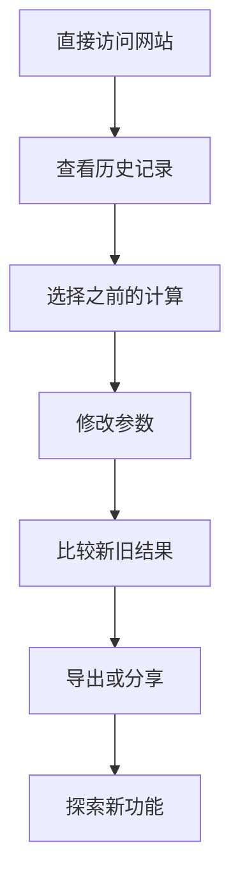
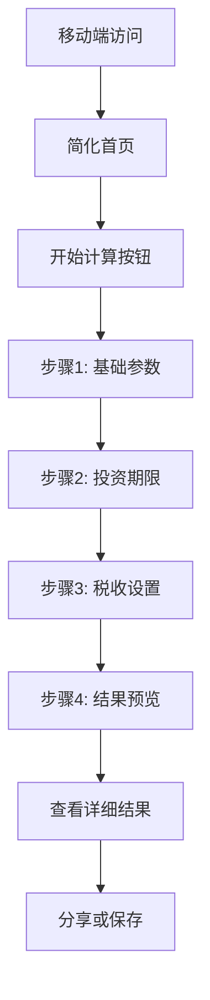
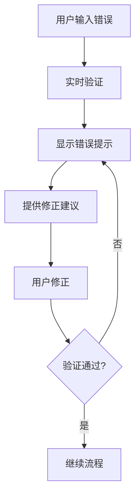
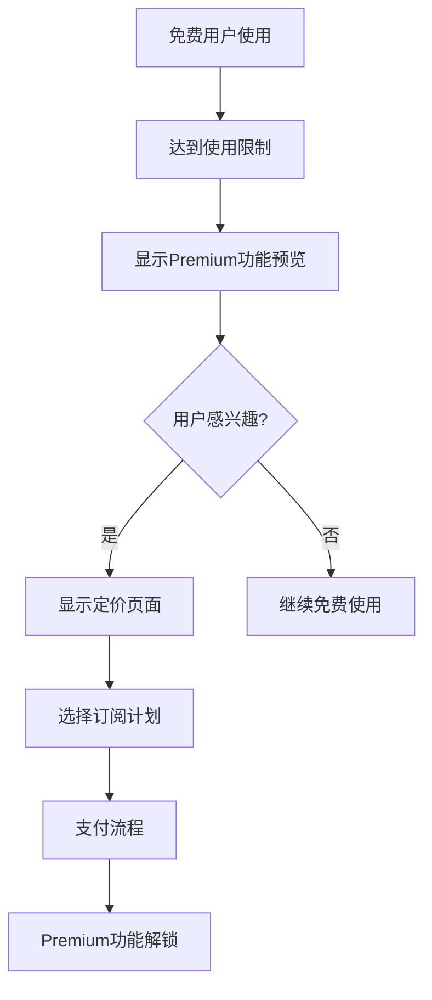

# 用户体验流程设计 - Zinses-Rechner

## 🎯 用户旅程地图

基于德国用户的金融计算需求和行为模式，设计了完整的用户体验流程。

### 1. 用户角色定义 (Personas)

#### 主要用户角色：保守投资者 Klaus (45岁)
```yaml
背景信息:
  年龄: 45岁
  职业: 工程师
  收入: 75,000€/年
  家庭: 已婚，2个孩子
  投资经验: 初级到中级

目标和需求:
  - 为退休储蓄规划
  - 了解复利效应
  - 优化税收策略
  - 确保投资安全性

痛点:
  - 对复杂金融产品不信任
  - 担心税收计算错误
  - 需要简单易懂的解释
  - 重视数据隐私

使用场景:
  - 周末在家研究投资选项
  - 与妻子讨论家庭财务规划
  - 比较不同银行产品
  - 计算退休所需储蓄
```

#### 次要用户角色：年轻专业人士 Anna (28岁)
```yaml
背景信息:
  年龄: 28岁
  职业: 市场营销经理
  收入: 55,000€/年
  家庭: 单身
  投资经验: 初级

目标和需求:
  - 开始投资理财
  - 了解ETF投资
  - 建立应急基金
  - 学习金融知识

痛点:
  - 缺乏投资知识
  - 不确定从何开始
  - 担心投资风险
  - 时间有限

使用场景:
  - 通勤时用手机查看
  - 午休时快速计算
  - 与朋友分享计算结果
  - 学习金融概念
```

### 2. 核心用户流程

#### 流程A：首次访问用户 (Discovery Journey)

```mermaid
graph TD
    A[Google搜索"Zinseszins Rechner"] --> B[访问首页]
    B --> C[查看Hero区域介绍]
    C --> D[尝试快速计算器]
    D --> E{结果满意?}
    E -->|是| F[查看详细结果]
    E -->|否| G[调整参数]
    G --> D
    F --> H[阅读解释说明]
    H --> I[探索其他计算器]
    I --> J[收藏网站/订阅]
```

**详细步骤设计：**

**步骤1: 首页着陆 (Landing)**
```vue
<!-- 首页Hero区域 -->
<section class="hero-section">
  <div class="hero-content">
    <h1 class="hero-title">
      Der vertrauenswürdigste Zinseszins-Rechner für Deutschland
    </h1>
    <p class="hero-subtitle">
      Berechnen Sie Ihr Vermögenswachstum mit deutschen Steueraspekten. 
      Kostenlos, transparent und DSGVO-konform.
    </p>
    
    <!-- 信任指标 -->
    <div class="trust-indicators">
      <div class="trust-item">
        <Icon name="shield-check" />
        <span>DSGVO-konform</span>
      </div>
      <div class="trust-item">
        <Icon name="calculator" />
        <span>Deutsche Steuergesetze</span>
      </div>
      <div class="trust-item">
        <Icon name="users" />
        <span>50.000+ Nutzer</span>
      </div>
    </div>
    
    <!-- 主要CTA -->
    <div class="hero-actions">
      <BaseButton 
        variant="primary" 
        size="lg"
        @click="scrollToQuickCalculator"
      >
        Jetzt kostenlos berechnen
      </BaseButton>
      <BaseButton 
        variant="secondary" 
        size="lg"
        @click="learnMore"
      >
        Mehr erfahren
      </BaseButton>
    </div>
  </div>
</section>
```

**步骤2: 快速计算体验**
```vue
<!-- 嵌入式快速计算器 -->
<section class="quick-calculator">
  <h2>Schnellrechner - Probieren Sie es aus</h2>
  
  <div class="quick-calc-container">
    <div class="input-section">
      <QuickInput
        v-model="quickForm.initialAmount"
        label="Startkapital"
        placeholder="10.000"
        suffix="€"
      />
      <QuickInput
        v-model="quickForm.monthlyAmount"
        label="Monatlich sparen"
        placeholder="500"
        suffix="€"
      />
      <QuickInput
        v-model="quickForm.years"
        label="Jahre"
        placeholder="15"
        type="number"
      />
    </div>
    
    <div class="result-preview">
      <div class="result-highlight">
        <span class="result-label">Ihr Endkapital:</span>
        <span class="result-value">{{ formatCurrency(quickResult.finalAmount) }}</span>
      </div>
      <div class="result-breakdown">
        <div>Eingezahlt: {{ formatCurrency(quickResult.totalPaid) }}</div>
        <div>Zinserträge: {{ formatCurrency(quickResult.totalInterest) }}</div>
      </div>
    </div>
  </div>
  
  <BaseButton 
    variant="primary"
    @click="goToFullCalculator"
  >
    Detaillierte Berechnung starten
  </BaseButton>
</section>
```

#### 流程B：回访用户 (Return Journey)



**历史记录界面设计：**
```vue
<template>
  <div class="calculation-history">
    <div class="history-header">
      <h2>Ihre Berechnungshistorie</h2>
      <div class="history-actions">
        <BaseButton variant="secondary" @click="exportHistory">
          Exportieren
        </BaseButton>
        <BaseButton variant="secondary" @click="clearHistory">
          Löschen
        </BaseButton>
      </div>
    </div>
    
    <div class="history-list">
      <HistoryCard
        v-for="item in historyItems"
        :key="item.id"
        :calculation="item"
        @select="loadCalculation"
        @favorite="toggleFavorite"
        @delete="deleteCalculation"
      />
    </div>
    
    <!-- 空状态 -->
    <div v-if="historyItems.length === 0" class="empty-history">
      <Icon name="calculator" size="lg" />
      <h3>Noch keine Berechnungen</h3>
      <p>Ihre Berechnungshistorie wird hier angezeigt</p>
      <BaseButton variant="primary" @click="startNewCalculation">
        Erste Berechnung starten
      </BaseButton>
    </div>
  </div>
</template>
```

### 3. 移动端用户流程优化

#### 移动端分步式表单流程



**移动端步骤式表单：**
```vue
<template>
  <div class="mobile-calculator-wizard">
    <!-- 进度指示器 -->
    <div class="progress-indicator">
      <div class="progress-bar">
        <div 
          class="progress-fill"
          :style="{ width: `${(currentStep / totalSteps) * 100}%` }"
        ></div>
      </div>
      <span class="progress-text">
        Schritt {{ currentStep }} von {{ totalSteps }}
      </span>
    </div>
    
    <!-- 当前步骤内容 -->
    <div class="step-content">
      <component
        :is="currentStepComponent"
        v-model="formData"
        @next="nextStep"
        @previous="previousStep"
        @validate="validateStep"
      />
    </div>
    
    <!-- 导航按钮 -->
    <div class="step-navigation">
      <BaseButton
        v-if="currentStep > 1"
        variant="secondary"
        @click="previousStep"
      >
        Zurück
      </BaseButton>
      
      <BaseButton
        v-if="currentStep < totalSteps"
        variant="primary"
        :disabled="!isStepValid"
        @click="nextStep"
      >
        Weiter
      </BaseButton>
      
      <BaseButton
        v-else
        variant="primary"
        :loading="isCalculating"
        @click="calculate"
      >
        Berechnen
      </BaseButton>
    </div>
  </div>
</template>
```

### 4. 错误处理和用户引导

#### 错误状态用户流程



**错误处理组件设计：**
```vue
<template>
  <div class="error-handling">
    <!-- 输入验证错误 -->
    <div v-if="validationErrors.length > 0" class="validation-errors">
      <div class="error-header">
        <Icon name="alert-circle" class="error-icon" />
        <h3>Bitte korrigieren Sie folgende Eingaben:</h3>
      </div>
      
      <ul class="error-list">
        <li 
          v-for="error in validationErrors"
          :key="error.field"
          class="error-item"
          @click="focusField(error.field)"
        >
          <strong>{{ error.fieldLabel }}:</strong> {{ error.message }}
        </li>
      </ul>
    </div>
    
    <!-- 计算错误 -->
    <div v-if="calculationError" class="calculation-error">
      <div class="error-content">
        <Icon name="calculator-x" size="lg" />
        <h3>Berechnung fehlgeschlagen</h3>
        <p>{{ calculationError.message }}</p>
        
        <div class="error-actions">
          <BaseButton variant="primary" @click="retryCalculation">
            Erneut versuchen
          </BaseButton>
          <BaseButton variant="secondary" @click="resetForm">
            Formular zurücksetzen
          </BaseButton>
        </div>
      </div>
    </div>
    
    <!-- 网络错误 -->
    <div v-if="networkError" class="network-error">
      <div class="error-content">
        <Icon name="wifi-off" size="lg" />
        <h3>Verbindungsfehler</h3>
        <p>Bitte überprüfen Sie Ihre Internetverbindung</p>
        
        <BaseButton variant="primary" @click="checkConnection">
          Verbindung prüfen
        </BaseButton>
      </div>
    </div>
  </div>
</template>
```

### 5. 用户引导和教育流程

#### 首次用户引导 (Onboarding)

```vue
<template>
  <div class="user-onboarding">
    <!-- 引导遮罩 -->
    <div v-if="showOnboarding" class="onboarding-overlay">
      <div class="onboarding-step" :class="currentOnboardingStep">
        <div class="step-content">
          <h3>{{ onboardingSteps[currentOnboardingStep].title }}</h3>
          <p>{{ onboardingSteps[currentOnboardingStep].description }}</p>
          
          <div class="step-actions">
            <BaseButton
              v-if="currentOnboardingStep > 0"
              variant="secondary"
              @click="previousOnboardingStep"
            >
              Zurück
            </BaseButton>
            
            <BaseButton
              v-if="currentOnboardingStep < onboardingSteps.length - 1"
              variant="primary"
              @click="nextOnboardingStep"
            >
              Weiter
            </BaseButton>
            
            <BaseButton
              v-else
              variant="primary"
              @click="completeOnboarding"
            >
              Los geht's!
            </BaseButton>
          </div>
          
          <button 
            class="skip-onboarding"
            @click="skipOnboarding"
          >
            Überspringen
          </button>
        </div>
      </div>
    </div>
  </div>
</template>

<script setup lang="ts">
const onboardingSteps = [
  {
    title: "Willkommen bei Zinses-Rechner",
    description: "Berechnen Sie Ihr Vermögenswachstum mit deutschen Steueraspekten",
    target: ".hero-section"
  },
  {
    title: "Geben Sie Ihre Daten ein",
    description: "Startkapital, monatliche Sparrate und Anlagedauer eingeben",
    target: ".calculator-form"
  },
  {
    title: "Deutsche Steueraspekte",
    description: "Berücksichtigen Sie Abgeltungssteuer und Freistellungsauftrag",
    target: ".tax-settings"
  },
  {
    title: "Ihre Ergebnisse",
    description: "Sehen Sie Ihr Vermögenswachstum in Zahlen und Grafiken",
    target: ".results-section"
  }
]
</script>
```

### 6. 转化优化流程

#### 免费用户到Premium转化



**Premium升级提示设计：**
```vue
<template>
  <div class="premium-upgrade-prompt">
    <div class="upgrade-modal" v-if="showUpgradeModal">
      <div class="modal-content">
        <div class="upgrade-header">
          <Icon name="star" class="premium-icon" />
          <h3>Erweitern Sie Ihre Möglichkeiten</h3>
        </div>
        
        <div class="premium-features">
          <div class="feature-item">
            <Icon name="download" />
            <span>Unbegrenzte PDF-Exporte</span>
          </div>
          <div class="feature-item">
            <Icon name="chart-bar" />
            <span>Erweiterte Diagramme</span>
          </div>
          <div class="feature-item">
            <Icon name="calculator" />
            <span>Alle Rechner-Tools</span>
          </div>
          <div class="feature-item">
            <Icon name="support" />
            <span>Priority Support</span>
          </div>
        </div>
        
        <div class="pricing-preview">
          <div class="price">
            <span class="currency">€</span>
            <span class="amount">9,99</span>
            <span class="period">/Monat</span>
          </div>
          <p class="price-note">Jederzeit kündbar</p>
        </div>
        
        <div class="upgrade-actions">
          <BaseButton variant="primary" size="lg" @click="startUpgrade">
            Jetzt upgraden
          </BaseButton>
          <BaseButton variant="secondary" @click="closeModal">
            Später
          </BaseButton>
        </div>
      </div>
    </div>
  </div>
</template>
```

这个用户体验流程文档涵盖了从首次访问到转化的完整用户旅程，特别针对德国用户的行为模式和需求进行了优化设计。每个流程都考虑了用户的心理状态和决策过程，确保提供最佳的用户体验。
